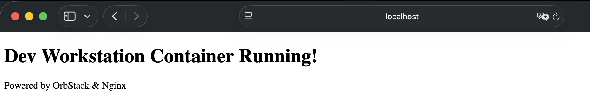

# 내 컴퓨터에 개발자용 '작업실' 꾸미기

## 1. 프로젝트 개요
`본 프로젝트는 개발의 시작점인 터미널 CLI 환경, Docker 컨테이너 기술, Git/GitHub 버전 관리 체계를 손수 구축하고 검증하는 과정입니다. `
`"내 컴퓨터에서만 동작하는 문제(It works on my machine)"를 방지하고, 서비스의 재현 가능성(Reproducibility)과 환경 격리(Isolation)를 보장할 수 있는 개발 워크스테이션 환경을 조성하는 것을 목표로 합니다.`
`특히, 서울캠퍼스 시스템 제한 환경(sudo 사용 제한)을 고려하여 **OrbStack** 기반의 비권한 컨테이너 실행 환경을 구축하고 실습을 진행하였습니다.`

---

## 2. 실행 환경
- `OS: macOS 26.5.1 arm64`
- `Container Runtime Environment: OrbStack (Non-sudo Docker Engine Provider)`
- `Shell / Terminal: Zsh / macOS Terminal`
- `Docker Version: Docker version 29.4.0 (OrbStack Engine)`
- `Git Version: git version 2.50.1 (Apple Git-155)`

---

## 3. 수행 항목 체크리스트
- [x] **터미널/권한**: 디렉토리 관리, 파일 조작, `chmod`를 통한 파일/디렉토리 8진수 권한 제어
- [x] **Docker 설치 및 점검**: OrbStack 기반 `docker --version`, `docker info` 동작 확인
- [x] **기본 컨테이너 조작**: `hello-world` 실행, `ubuntu` 진입 및 `exec`/`attach` 동작 차이 이해
- [x] **Dockerfile 커스텀 이미지**: Nginx 베이스 이미지를 활용한 커스텀 웹 서버 빌드
- [x] **포트 매핑**: `-p 8080:80` 포트 바인딩 및 접속 검증 (`curl` & 브라우저)
- [x] **바인드 마운트**: 호스트 코드 수정의 실시간 컨테이너 반영 검증
- [x] **볼륨 영속성**: Docker Volume 생성 및 컨테이너 파기 후 데이터 보존 검증
- [x] **Git & GitHub 연동**: `git config` 완료 및 VSCode GitHub 인증 연결

---

## 4. 디렉토리 구조 (Directory Tree)

```text
E1-1/
├── practice/
│   ├── app/
│   │   └── index.html
│   ├── images/
│   │   ├── localhost_8080.png
│   │   └── localhost_8081.png
│   ├── perm_dir/
│   ├── Dockerfile
│   ├── perm_file.txt
│   └── renamed_test.txt
└── README.md
```

---

## 5. 수행 및 검증 로그

### 5.1. 터미널 조작 및 권한 관리
`터미널 명령어 기반의 파일 생성, 이동, 복사, 삭제 및 권한 체계(r/w/x) 실습 결과입니다.`

- 현재 위치 확인 및 디렉토리 생성/이동
```bash
jung@MyHomeui-MacBookAir E1-1 % pwd
/Users/jung/Desktop/woochul_codyssey/E1-1
jung@MyHomeui-MacBookAir E1-1 % mkdir -p practice
jung@MyHomeui-MacBookAir E1-1 % cd practice
jung@MyHomeui-MacBookAir practice % 
```

- 파일 생성, 내용 확인, 복사, 이름 변경, 삭제
```bash
jung@MyHomeui-MacBookAir practice % echo "Hello Workstation" > test.txt
jung@MyHomeui-MacBookAir practice % cat test.txt
Hello Workstation
jung@MyHomeui-MacBookAir practice % cp test.txt copy_test.txt
jung@MyHomeui-MacBookAir practice % ls
copy_test.txt	test.txt
jung@MyHomeui-MacBookAir practice % mv copy_test.txt renamed_test.txt
jung@MyHomeui-MacBookAir practice % ls
renamed_test.txt	test.txt
jung@MyHomeui-MacBookAir practice % rm test.txt
jung@MyHomeui-MacBookAir practice % ls -la
total 8
drwxr-xr-x  3 jung  staff   96  8월  5 16:49 .
drwxr-xr-x  4 jung  staff  128  8월  5 16:44 ..
-rw-r--r--  1 jung  staff   18  8월  5 16:49 renamed_test.txt
```

- 권한 변경 실습 (파일 1개, 디렉토리 1개)
```bash
jung@MyHomeui-MacBookAir practice % echo "Permission Test File" > perm_file.txt
jung@MyHomeui-MacBookAir practice % mkdir perm_dir
jung@MyHomeui-MacBookAir practice % ls -ld perm_file.txt perm_dir
drwxr-xr-x  2 jung  staff  64  8월  5 16:52 perm_dir
-rw-r--r--  1 jung  staff   0  8월  5 16:52 perm_file.txt
jung@MyHomeui-MacBookAir practice % chmod 644 perm_file.txt
jung@MyHomeui-MacBookAir practice % chmod 700 perm_dir
jung@MyHomeui-MacBookAir practice % ls -ld perm_file.txt perm_dir
drwx------  2 jung  staff  64  8월  5 16:52 perm_dir
-rw-r--r--  1 jung  staff   0  8월  5 16:52 perm_file.txt
```

### 5.2. Docker 점검 및 기본 컨테이너 운용
`OrbStack을 활용하여 sudo 없이 Docker 데몬을 정상 호출합니다.`

- 버전 및 데몬 상태 점검
```bash
jung@MyHomeui-MacBookAir practice % docker --version
Docker version 29.4.0, build 9d7ad9f
jung@MyHomeui-MacBookAir practice % docker info
Client:
 Version:    29.4.0
 Context:    orbstack
 Debug Mode: false
 Plugins:
  buildx: Docker Buildx (Docker Inc.)
    Version:  v0.33.0
    Path:     /Users/jung/.docker/cli-plugins/docker-buildx
  compose: Docker Compose (Docker Inc.)
    Version:  v5.1.2
    Path:     /Users/jung/.docker/cli-plugins/docker-compose

Server:
 Containers: 0
  Running: 0
  Paused: 0
  Stopped: 0
 Images: 0
 Server Version: 29.4.0
 Storage Driver: overlayfs
  driver-type: io.containerd.snapshotter.v1
 Logging Driver: json-file
 Cgroup Driver: cgroupfs
 Cgroup Version: 2
 Plugins:
  Volume: local
  Network: bridge host ipvlan macvlan null overlay
  Log: awslogs fluentd gcplogs gelf journald json-file local splunk syslog
 CDI spec directories:
  /etc/cdi
  /var/run/cdi
 Swarm: inactive
 Runtimes: io.containerd.runc.v2 runc
 Default Runtime: runc
 Init Binary: docker-init
 containerd version: 301b2dac98f15c27117da5c8af12118a041a31d9
 runc version: bb14dabeb7185bb72c8c86735d090dcb20f36587
 init version: de40ad0
 Security Options:
  seccomp
   Profile: builtin
  cgroupns
 Kernel Version: 7.0.14-orbstack-00374-gbbca68e8d741
 Operating System: OrbStack
 OSType: linux
 Architecture: aarch64
 CPUs: 8
 Total Memory: 7.818GiB
 Name: orbstack
 ID: 145ebf22-ee90-4f6b-ae4a-daacff711cad
 Docker Root Dir: /var/lib/docker
 Debug Mode: false
 HTTP Proxy: http://proxy.orb.internal:8305
 HTTPS Proxy: http://proxy.orb.internal:8305
 No Proxy: localhost,127.0.0.1,127.0.0.0/8,::1,10.0.0.0/8,172.16.0.0/12,192.168.0.0/16,0.250.250.0/24,*.orb.internal,*.local,gateway.docker.internal,host.internal,host.docker.internal,host.lima.internal,docker.for.mac.localhost,docker.for.mac.host.internal
 Experimental: true
 Insecure Registries:
  ::1/128
  127.0.0.0/8
 Live Restore Enabled: false
 Product License: Community Engine
 Default Address Pools:
   Base: 192.168.97.0/24, Size: 24
   Base: 192.168.107.0/24, Size: 24
   Base: 192.168.117.0/24, Size: 24
   Base: 192.168.147.0/24, Size: 24
   Base: 192.168.148.0/24, Size: 24
   Base: 192.168.155.0/24, Size: 24
   Base: 192.168.156.0/24, Size: 24
   Base: 192.168.158.0/24, Size: 24
   Base: 192.168.163.0/24, Size: 24
   Base: 192.168.164.0/24, Size: 24
   Base: 192.168.165.0/24, Size: 24
   Base: 192.168.166.0/24, Size: 24
   Base: 192.168.167.0/24, Size: 24
   Base: 192.168.171.0/24, Size: 24
   Base: 192.168.172.0/24, Size: 24
   Base: 192.168.181.0/24, Size: 24
   Base: 192.168.183.0/24, Size: 24
   Base: 192.168.186.0/24, Size: 24
   Base: 192.168.207.0/24, Size: 24
   Base: 192.168.214.0/24, Size: 24
   Base: 192.168.215.0/24, Size: 24
   Base: 192.168.216.0/24, Size: 24
   Base: 192.168.223.0/24, Size: 24
   Base: 192.168.227.0/24, Size: 24
   Base: 192.168.228.0/24, Size: 24
   Base: 192.168.229.0/24, Size: 24
   Base: 192.168.237.0/24, Size: 24
   Base: 192.168.239.0/24, Size: 24
   Base: 192.168.242.0/24, Size: 24
   Base: 192.168.247.0/24, Size: 24
   Base: fd07:b51a:cc66:d000::/56, Size: 64
 Firewall Backend: iptables

WARNING: DOCKER_INSECURE_NO_IPTABLES_RAW is set
```

- hello-world 컨테이너 실행
```bash
jung@MyHomeui-MacBookAir practice % docker run --name hello-test hello-world
Unable to find image 'hello-world:latest' locally
latest: Pulling from library/hello-world
58dee6a49ef1: Pull complete 
c3bdf82c34d1: Download complete 
Digest: sha256:7f4da0fc94bcece205a8c0b6f4d11c8196924654ffe5c4d1aa439b7f632048b2
Status: Downloaded newer image for hello-world:latest

Hello from Docker!
This message shows that your installation appears to be working correctly.

To generate this message, Docker took the following steps:
 1. The Docker client contacted the Docker daemon.
 2. The Docker daemon pulled the "hello-world" image from the Docker Hub.
    (arm64v8)
 3. The Docker daemon created a new container from that image which runs the
    executable that produces the output you are currently reading.
 4. The Docker daemon streamed that output to the Docker client, which sent it
    to your terminal.

To try something more ambitious, you can run an Ubuntu container with:
 $ docker run -it ubuntu bash

Share images, automate workflows, and more with a free Docker ID:
 https://hub.docker.com/

For more examples and ideas, visit:
 https://docs.docker.com/get-started/
```

- ubuntu 컨테이너 실행 및 내부 명령어 조작 (exec/attach 개념 이해)
```bash
jung@MyHomeui-MacBookAir practice % docker run -d --name my-ubuntu ubuntu sleep infinity
Unable to find image 'ubuntu:latest' locally
latest: Pulling from library/ubuntu
557836a62b76: Pull complete 
d73407a274fb: Pull complete 
277f396f91f3: Download complete 
Digest: sha256:678c6550cc43645e08669028bc177f50be4e7c5b8cca677067b1914d4afc7a03
Status: Downloaded newer image for ubuntu:latest
5cadf0e64c843b2826d9a31fd7c7965d1c22466e275f7be697f57b0a1cbc3e17
jung@MyHomeui-MacBookAir practice % docker exec -it my-ubuntu bash -c "ls -la &&echo 'Inside Ubuntu Container'"
total 12
drwxr-xr-x   1 root root   6 Aug  5 08:01 .
drwxr-xr-x   1 root root   6 Aug  5 08:01 ..
-rwxr-xr-x   1 root root   0 Aug  5 08:01 .dockerenv
drwxr-xr-x   1 root root  26 Jul 24 13:05 .rock
lrwxrwxrwx   1 root root   7 Apr 20 08:46 bin -> usr/bin
drwxr-xr-x   1 root root   0 Apr 20 08:46 boot
drwxr-xr-x   5 root root 320 Aug  5 08:01 dev
drwxr-xr-x   1 root root  56 Aug  5 08:01 etc
drwxr-xr-x   1 root root  12 Jul 24 13:05 home
lrwxrwxrwx   1 root root   7 Apr 20 08:46 lib -> usr/lib
drwxr-xr-x   1 root root   0 Jul 24 13:02 media
drwxr-xr-x   1 root root   0 Jul 24 13:02 mnt
drwxr-xr-x   1 root root   0 Jul 24 13:02 opt
dr-xr-xr-x 217 root root   0 Aug  5 08:01 proc
drwx------   1 root root  30 Jul 24 13:05 root
drwxr-xr-x   1 root root  22 Jul 24 13:05 run
lrwxrwxrwx   1 root root   8 Apr 20 08:46 sbin -> usr/sbin
drwxr-xr-x   1 root root   0 Jul 24 13:02 srv
dr-xr-xr-x  11 root root   0 Aug  5 08:01 sys
drwxrwxrwt   1 root root   0 Jul 24 13:03 tmp
drwxr-xr-x   1 root root  10 Jul 24 13:01 usr
drwxr-xr-x   1 root root  90 Jul 24 13:05 var
Inside Ubuntu Container
```

- 이미지 및 컨테이너 리소스/로그 확인
```bash
jung@MyHomeui-MacBookAir practice % docker images
                                                                              i Info →   U  In Use
IMAGE                ID             DISK USAGE   CONTENT SIZE   EXTRA
hello-world:latest   7f4da0fc94bc       18.5kB         10.3kB    U   
ubuntu:latest        678c6550cc43        178MB         44.4MB    U   
jung@MyHomeui-MacBookAir practice % docker ps -a
CONTAINER ID   IMAGE         COMMAND            CREATED         STATUS                     PORTS     NAMES
5cadf0e64c84   ubuntu        "sleep infinity"   5 minutes ago   Up 5 minutes                         my-ubuntu
39a91085e37e   hello-world   "/hello"           9 minutes ago   Exited (0) 9 minutes ago             hello-test
jung@MyHomeui-MacBookAir practice % docker logs my-ubuntu
jung@MyHomeui-MacBookAir practice % docker stats --no-stream
CONTAINER ID   NAME        CPU %     MEM USAGE / LIMIT     MEM %     NET I/O         BLOCK I/O     PIDS
5cadf0e64c84   my-ubuntu   0.00%     2.203MiB / 7.818GiB   0.03%     1.13kB / 126B   16.2MB / 0B   1
```

- 프로젝트 폴더 세팅
```bash
jung@MyHomeui-MacBookAir practice % mkdir -p app
jung@MyHomeui-MacBookAir practice % ls
app			perm_dir		perm_file.txt		renamed_test.txt
```

- 웹 서버에 띄울 HTML 작성
```bash
jung@MyHomeui-MacBookAir practice % cat << 'EOF' > app/index.html
<!DOCTYPE html>
<html>
<head>
    <meta charset="UTF-8">
    <title>Dev Workstation</title>
</head>
<body>
    <h1>Dev Workstation Container Running!</h1>
    <p>Powered by OrbStack & Nginx</p>
</body>
</html>
EOF
jung@MyHomeui-MacBookAir practice % ls app
index.html
```

- 개념 정리
    - `docker attach: 컨테이너의 Standard Input/Output/Error(PID 1 메인 프로세스)에 직접 연결됩니다. 터미널을 종료하면 메인 프로세스에 영향을 주어 컨테이너가 멈출 수 있습니다.`

    - `docker exec: 이미 실행 중인 컨테이너 내부에서 새로운 별도의 프로세스를 추가로 실행합니다. 디버깅 및 작업 시 기존 실행 환경을 방해하지 않고 독립적으로 명령을 수행할 수 있습니다.`

### 5.3. Dockerfile 기반 커스텀 웹 서버
- Dockerfile 작성 (Nginx 베이스)
```bash
jung@MyHomeui-MacBookAir practice % cat << 'EOF' > Dockerfile
FROM nginx:alpine
LABEL maintainer="student"
LABEL description="Custom Nginx Web Server for Dev Workstation"
```

- 정적 파일 교체
```bash
heredoc> COPY app/index.html /usr/share/nginx/html/index.html

EXPOSE 80
CMD ["nginx", "-g", "daemon off;"]
EOF
```

- 커스텀 이미지 빌드
```bash
jung@MyHomeui-MacBookAir practice % docker build -t my-custom-web:1.0 .
[+] Building 5.0s (7/7) FINISHED                                                   docker:orbstack
 => [internal] load build definition from Dockerfile                                          0.0s
 => => transferring dockerfile: 247B                                                          0.0s
 => [internal] load metadata for docker.io/library/nginx:alpine                               2.8s
 => [internal] load .dockerignore                                                             0.0s
 => => transferring context: 2B                                                               0.0s
 => [internal] load build context                                                             0.1s
 => => transferring context: 280B                                                             0.0s
 => [1/2] FROM docker.io/library/nginx:alpine@sha256:4a73073bd557c65b759505da037898b61f1be6c  1.9s
 => => resolve docker.io/library/nginx:alpine@sha256:4a73073bd557c65b759505da037898b61f1be6c  0.0s
 => => sha256:977aedb192ade9f4f62ce4c6df02d8f62abe1e8710e006854398f8a7cda0 19.85MB / 19.85MB  0.9s
 => => sha256:ba4be3b26f08037fa63337d7a425d3253b887bff559447733e71759f65b0f8 1.40kB / 1.40kB  0.2s
 => => sha256:e1f13a453c9dd406f331a3efefeb846cd18b068d73177c0d57c6f3d5169eac 1.21kB / 1.21kB  0.7s
 => => sha256:c4a042f5cf717d2e64d2176a41624344a2f1ad0475f6ac6dae092aefbbd07b37 405B / 405B    0.7s
 => => sha256:d0e9565ba4ff139c848073b3358bb2c9b31a93cb9b744a5b0903b22f5a3ddc0f 956B / 956B    0.5s
 => => sha256:e42993d4c6ecb26b388e945cbe5f03be1f7858226750c1f8375883db2aae1243 626B / 626B    0.2s
 => => sha256:7b1fb50ff9dc606dba8c8c0e8eb4e98c650c5b289506f01724309ebf71a69d 1.91MB / 1.91MB  0.3s
 => => sha256:5de55e5ef9c033997441461efe7ba23a986db059c0bb78b38f84ee0d72b991 4.18MB / 4.18MB  0.5s
 => => extracting sha256:5de55e5ef9c033997441461efe7ba23a986db059c0bb78b38f84ee0d72b99167     0.1s
 => => extracting sha256:7b1fb50ff9dc606dba8c8c0e8eb4e98c650c5b289506f01724309ebf71a69d45     0.0s
 => => extracting sha256:e42993d4c6ecb26b388e945cbe5f03be1f7858226750c1f8375883db2aae1243     0.0s
 => => extracting sha256:d0e9565ba4ff139c848073b3358bb2c9b31a93cb9b744a5b0903b22f5a3ddc0f     0.0s
 => => extracting sha256:c4a042f5cf717d2e64d2176a41624344a2f1ad0475f6ac6dae092aefbbd07b37     0.0s
 => => extracting sha256:e1f13a453c9dd406f331a3efefeb846cd18b068d73177c0d57c6f3d5169eacb4     0.0s
 => => extracting sha256:ba4be3b26f08037fa63337d7a425d3253b887bff559447733e71759f65b0f8c8     0.0s
 => => extracting sha256:977aedb192ade9f4f62ce4c6df02d8f62abe1e8710e006854398f8a7cda030e7     0.2s
 => [2/2] COPY app/index.html /usr/share/nginx/html/index.html                                0.1s
 => exporting to image                                                                        0.1s
 => => exporting layers                                                                       0.1s
 => => exporting manifest sha256:2b46de599cdd5f82d0df782c65d15e6d220b75e9f210d308fdca576f7f5  0.0s
 => => exporting config sha256:fef7a35b27ea485ec80fb80b0b09dfea987b433ba950e49f14bf103631a31  0.0s
 => => exporting attestation manifest sha256:e6c569c5709fc0f30c049f4dd8e956a71ec8c2f79db1986  0.0s
 => => exporting manifest list sha256:5216378750a75fdd35ba0cf22dc9116c307c0dafda041c5a76f0f9  0.0s
 => => naming to docker.io/library/my-custom-web:1.0                                          0.0s
 => => unpacking to docker.io/library/my-custom-web:1.0                                       0.0s
```

- 포트 매핑 컨테이너 실행 (8080 포트)
```bash
jung@MyHomeui-MacBookAir practice % docker run -d -p 8080:80 --name web-8080 my-custom-web:1.0
07d7fa0bbb1d639a6c68ecb41dbe73769a7735c98cfb15a37448fc1ab559d48d
```

- 접속 검증 (curl 및 브라우저에서 http://localhost:8080 접속)
```bash
jung@MyHomeui-MacBookAir practice % curl http://localhost:8080
<!DOCTYPE html>
<html>
<head>
    <meta charset="UTF-8">
    <title>Dev Workstation</title>
</head>
<body>
    <h1>Dev Workstation Container Running!</h1>
    <p>Powered by OrbStack & Nginx</p>
</body>
</html>
```


### 5.4. 바인드 마운트 및 볼륨 영속성 검증
#### A. 바인드 마운트 (Bind Mount) - 변경사항 실시간 반영
`호스트의 app/ 디렉토리를 컨테이너 내부 /usr/share/nginx/html에 바인드 마운트하여 실시간 코드 수정을 검증했습니다.`

- 바인드 마운트 실습 (호스트의 app 폴더를 컨테이너에 실시간 연결)
```bash
jung@MyHomeui-MacBookAir practice % docker run -d -p 8081:80 --name web-bind -v $(pwd)/app:/usr/share/nginx/html nginx:alpine
Unable to find image 'nginx:alpine' locally
alpine: Pulling from library/nginx
Digest: sha256:4a73073bd557c65b759505da037898b61f1be6cbcc3c2c3aeac22d2a470c1752
Status: Downloaded newer image for nginx:alpine
07afd8a4849762aaf267ed0a1a22a5bf1099dd67bfde61da48e5fea8af358036
```

- 호스트 파일 변경 전 확인
```bash
jung@MyHomeui-MacBookAir practice % curl http://localhost:8081
<!DOCTYPE html>
<html>
<head>
    <meta charset="UTF-8">
    <title>Dev Workstation</title>
</head>
<body>
    <h1>Dev Workstation Container Running!</h1>
    <p>Powered by OrbStack & Nginx</p>
</body>
</html>
```

- 호스트 파일 수정
```bash
jung@MyHomeui-MacBookAir practice % echo '<h1>Updated via Bind Mount!</h1>' > app/index.html
```

- 호스트 파일 변경 후 컨테이너 자동 반영 확인
```bash
jung@MyHomeui-MacBookAir practice % curl http://localhost:8081
<h1>Updated via Bind Mount!</h1>
```


#### B. Docker Volume - 데이터 영속성(Persistence) 검증
`컨테이너가 파기되더라도 Docker 볼륨 내 저장된 데이터는 유실되지 않음을 검증했습니다.`

- 볼륨 생성
```bash
jung@MyHomeui-MacBookAir practice % docker volume create my-app-data
my-app-data
```

- 컨테이너 1 생성 후 볼륨에 데이터 쓰기
```bash
jung@MyHomeui-MacBookAir practice % docker run -d --name vol-container-1 -v my-app-data:/data ubuntu sleep infinity
0984d150eeacb9728753a79fce6825c4d70e232825635f420a4c58c4409cbd87
jung@MyHomeui-MacBookAir practice % docker exec vol-container-1 bash -c "echo 'Persistent Data Saved' > /data/persistence.txt"
jung@MyHomeui-MacBookAir practice % docker exec vol-container-1 cat /data/persistence.txt
Persistent Data Saved
```

- 컨테이너 1 강제 삭제
```bash
jung@MyHomeui-MacBookAir practice % docker rm -f vol-container-1
vol-container-1
```

- 컨테이너 2 생성 후 동일 볼륨 연결하여 데이터 유지 검증
```bash
jung@MyHomeui-MacBookAir practice % docker run -d --name vol-container-2 -v my-app-data:/data ubuntu sleep infinity
ebe08aff8cb9a343ce558a98f38546083b4cf98883aa51219884cc3e6ca5a19e
jung@MyHomeui-MacBookAir practice % docker exec vol-container-2 cat /data/persistence.txt
Persistent Data Saved
```

-테스트 정리
```bash
jung@MyHomeui-MacBookAir practice % docker rm -f vol-container-2
vol-container-2
```

### 5.5. Git 설정 및 GitHub/VSCode 연동
- Git 사용자 및 기본 브랜치 설정
```bash
jung@MyHomeui-MacBookAir practice % git config --global user.name "woochul0516"
jung@MyHomeui-MacBookAir practice % git config --global user.email "dncjf55252@gmail.com"  
jung@MyHomeui-MacBookAir practice % git config --global init.defaultBranch main
```

- 설정 목록 확인 및 출력
```bash
jung@MyHomeui-MacBookAir practice % git config --list
credential.helper=osxkeychain
init.defaultbranch=main
user.name=woochul0516
user.email=dncjf55252@gmail.com
init.defaultbranch=main
core.repositoryformatversion=0
core.filemode=true
core.bare=false
core.logallrefupdates=true
core.ignorecase=true
core.precomposeunicode=true
remote.origin.url=https://github.com/woochul0516/woochul_codyssey
remote.origin.fetch=+refs/heads/*:refs/remotes/origin/*
branch.main.remote=origin
branch.main.merge=refs/heads/main
branch.main.vscode-merge-base=origin/main
```

---

### 6. 트러블슈팅 (Troubleshooting)
#### 6.1. EOF 사용법 미숙지
- `문제 : "cat << 'EOF' > Dockerfile" 를 입력 시 실행하고자 하는 명령어들을 입력해도 "heredoc>"가 떠서 기존 터미널로 돌아가지 못하는 상황이 발생.`

- `해결 방안 : 해당 화면에서 "EOF" 입력 후 Enter 키 입력 시 해결 가능. 추후 "cat Dockerfile"을 입력하여 정상적으로 생성되었는지도 확인 `

#### 6.2. echo 에러
- `문제 : "echo "<h1>Updated via Bind Mount!</h1>" > app/index.html" 입력 시 "zsh: event not found: </h1>"가 뜨며 에러가 발생함.`

- `해결 방안 : ! 문자가 쉘 해석기에 걸리지 않도록 작은따옴표(')로 문장을 감싸서 실행하시면 깔끔하게 해결됨. zsh 쉘에서 " 안에 !</h1>이 들어있어서 이를 명령어 히스토리 이벤트로 해석하려고 하여 발생한 에러.`

---

### 7. 과제 학습 목표 정리
#### 7.1. 절대 경로 vs 상대 경로
- `절대 경로: 최상위 루트 디렉토리(/)부터 시작하는 전체 경로 (예: /usr/share/nginx/html). 현재 작업 위치와 무관하게 항상 동일한 위치를 지칭합니다.`
- `상대 경로: 현재 위치(.) 기준의 경로 (예: ./app/index.html 또는 ../config). 실행 위치에 따라 가리키는 대상이 변합니다.`

#### 7.2. 파일 권한(r/w/x)과 8진수 표기(755, 644)
- `r(Read=4), w(Write=2), x(Execute=1)의 합산으로 [소유자/그룹/기타] 권한을 결정합니다.`
- `755 (rwxr-xr-x): 소유자는 읽기/쓰기/실행(4+2+1=7) 가능, 그룹 및 기타 사용자는 읽기/실행(4+1=5)만 가능. (디렉토리 및 실행파일 기본값)`
- `644 (rw-r--r--): 소유자는 읽기/쓰기(4+2=6) 가능, 그룹 및 기타 사용자는 읽기(4)만 가능. (일반 문서 파일 기본값)`

#### 7.3. 포트 매핑(-p <host_port>:<container_port>)이 필요한 이유
- `Docker 컨테이너는 호스트 및 다른 컨테이너와 격리된 자체 가상 IP 네트워크를 가집니다.`
- `외부(호스트 웹 브라우저 등)에서 컨테이너 내부의 서비스(예: Nginx 80 포트)에 접근하려면, 호스트 PC의 특정 포트(예: 8080)로 들어오는 요청을 컨테이너 포트로 전달해 주는 포트 바인딩/포워딩 설정이 반드시 필요합니다.`

#### 7.4. Docker 볼륨(Volume)과 영속 데이터
- `컨테이너는 "무상태(Stateless)"를 지향하므로, 컨테이너가 삭제되면 내부 계층에 쓰여진 모든 데이터가 사라집니다.`
- `데이터를 영구히 보존하기 위해 Docker가 관리하는 호스트 파일시스템의 특정 영역을 컨테이너 마운트 포인트에 연결하는 기술이 Docker Volume입니다. 이를 통해 컨테이너의 Lifecycle과 데이터의 Lifecycle을 분리(Decoupling)할 수 있습니다.`

#### 7.5. Git vs GitHub의 역할 차이
- `Git: 로컬 컴퓨터에서 소스코드의 변경 이력을 추적하고 버전을 관리하는 분산 버전 관리 시스템(DVCS) 소프트웨어입니다.`
- `GitHub: Git으로 관리되는 프로젝트를 클라우드에 저장하고, 팀원 간의 코드 공유, Pull Request, 이슈 트래킹, CI/CD 등을 제공하는 원격 저장소 웹 호스팅 플랫폼입니다.`