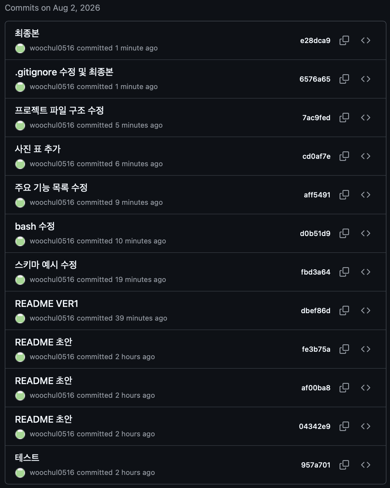

# 컴퓨터에게 명령 내리는 말(파이썬) 처음 배우기
`Python 기초 문법과 객체지향 프로그래밍(OOP), JSON 파일 입출력, 그리고 Git 버전 관리를 실습하기 위해 제작된 터미널 기반 퀴즈 게임 프로젝트입니다.`

---

## 1. 프로젝트 개요 및 과제 목표
- 프로젝트명: 컴퓨터 하드웨어 CLI 퀴즈 게임
- 개발 환경: Python 3.10+ (표준 라이브러리만 사용)
- 주요 목표:
    - Python 기본 문법(변수, 자료형, 제어문, 함수) 및 클래스(OOP) 활용법 습득
    - `state.json` 파일 읽기/쓰기를 통한 데이터 영속성 구현 및 예외 처리
    - Git 기초 명령어 사용, 브랜치 기반 작업 및 원격 저장소(`clone`/`pull`) 동기화 실습

---

## 2. 퀴즈 주제 및 선정 이유
- 주제: 컴퓨터 하드웨어 기초 개념
- 선정 이유: 개발자 및 IT 학습자가 알아야 할 기초 컴퓨터 구조(CPU, RAM, SSD, 메인보드 등) 지식을 복습하기에 적합하며, 직관적인 4지선다형 문제 구조를 활용해 데이터를 구조화하기 용이하여 선택했습니다.

---

## 3. 실행 방법 및 설명
환경 요구사항
- Python 3.10 이상 설치 필요
- 추가 외부 라이브러리 설치 필요 없음 (Python 표준 라이브러리만 사용)

상세 실행 단계
#### 1. 저장소 복제 및 프로젝트 디렉터리 이동
```bash
git clone https://github.com/woochul0516/woochul_codyssey.git
cd woochul_codyssey/E1-2
```

#### 2. 프로그램 실행
`터미널(또는 Command Prompt/PowerShell)에서 아래 명령어를 실행합니다.`
```bash
python main.py
```
macOS / Linux 환경에서는 Python 3 버전에 맞게 `python3 main.py`로 실행할 수 있습니다.

#### 3. 메뉴 선택 및 게임 진행 방식
- 터미널에 번호 메뉴(1~6)가 출력되면 원하는 기능의 번호를 입력 후 `Enter`를 누릅니다.
- `1. 퀴즈 풀기`: 풀 문제 수를 선택하고, 각 문제마다 1~4 사이의 번호 또는 힌트(`H`)를 입력합니다.
- `2. 퀴즈 추가`: 문제 문구, 보기 4개, 정답 번호, 힌트를 입력하여 새 퀴즈를 등록합니다.
- `3. 퀴즈 목록 보기`: 저장된 모든 퀴즈 정보 및 정답/힌트를 조회합니다.
- `4. 퀴즈 삭제`: 삭제를 원하는 퀴즈 번호를 선택하여 제거합니다.
- `5. 점수 및 기록 확인`: 최고 점수와 최근 플레이 이력을 확인합니다.
- `6. 종료`: 데이터를 안전하게 저장하고 프로그램을 종료합니다. (`Ctrl+C` 입력 시에도 안전 종료 처리)

---

## 4. 기능 및 예외 처리 요구사항 구현 현황
### 공통 입력 및 예외 처리 기준
- 공통 입력 검증:
  - 모든 입력값의 앞뒤 공백을 제거(`.strip()`)하여 입력 유효성을 판단합니다.
  - 잘못된 입력 처리 (문자 / 범위 밖 숫자 / 공백):
    - 정답 번호 입력 시 1~4 번호나 힌트 키(`H`, `h`)가 아닌 문자열(예: `abc`, `!@#`), 범위를 벗어난 숫자(예: `0`, `5`), 빈 엔터 입력 시 `[!] 올바른 선택지를 입력해주세요.` 경고 메시지를 출력합니다.
  - 재입력 루프 복귀:
    - 잘못된 입력이 들어오더라도 오류가 발생하거나 문제를 건너뛰지 않고, `while True` 루프 구조를 통해 올바른 정답(1~4) 또는 힌트(`H`)를 입력할 때까지 안전하게 동일 문제의 입력 대기 상태로 복귀합니다.
- 비정상 종료 방지:
  - 실행 중 `Ctrl+C`(`KeyboardInterrupt`) 또는 입력 스트림 종료(`EOFError`) 발생 시 트레이스백 오류 없이 안내 메시지를 출력하고, 현재 데이터를 자동 저장한 후 안전하게 종료합니다.
- 데이터 파일 예외 방지:
  - `state.json` 파일이 없거나 파일이 손상된 경우(`FileNotFoundError`, `JSONDecodeError`), 안내 메시지를 출력한 뒤 기본 퀴즈 데이터 5개로 복구/초기화하여 정상 실행을 보장합니다.

### 주요 기능 목록
1. 메뉴 기능:
   - 실행 시 1~6번 메뉴 출력 및 사용자 선택 기능 제공
2. 퀴즈 풀기 (브랜치 활용):
   - `random.sample`을 이용한 문제 무작위 출제
   - 풀고 싶은 문제 수 선택 기능 제공
   - 힌트 보기(`H`) 제공 (사용 시 정답 점수 0.5점 차감)
   - 정답/오답 검증, 문자 및 범위 밖 숫자 입력 예외 처리, 최종 결과 출력
3. 퀴즈 추가:
   - 문제, 보기 4개, 정답 번호(1~4), 힌트를 입력받아 등록 및 파일 자동 저장
4. 퀴즈 목록:
   - 저장된 전체 퀴즈 문제, 보기, 정답, 힌트 조회
5. 퀴즈 삭제:
   - 삭제할 번호를 선택하여 안전하게 제거 후 파일 업데이트
6. 점수 및 히스토리 확인:
   - 역대 최고 점수 확인 및 갱신 기능
   - 최근 5회 게임 기록(일시, 푼 문제 수, 점수) 출력

---

## 5. 파일 구조
```text
E1-2/
├── images/
│   ├── add_quiz.png      # 퀴즈 추가 실행 스크린샷
│   ├── del_quiz.png      # 퀴즈 삭제 실행 스크린샷
│   ├── list_quiz.png     # 퀴즈 목록 실행 스크린샷
│   ├── menu_quiz.png     # 메인 메뉴 실행 스크린샷
│   ├── score_quiz.png    # 점수 및 기록 확인 스크린샷
│   ├── solve_quiz.png    # 퀴즈 풀기 실행 스크린샷
│   └── commit.png        # Git 커밋 내역 스크린샷
├── .gitignore            # Git 추적 제외 파일 설정
├── main.py               # 메인 소스코드 (Quiz, QuizGame 클래스 구현)
├── README.md             # 프로젝트 설명 문서
└── state.json            # 퀴즈, 최고 점수, 플레이 히스토리 저장 파일 (UTF-8)
```

---

## 6. 실습 스크린샷

| 기능 구분 | 스크린샷 예시 |
| :--- | :---: |
| **메인 메뉴 화면** |  |
| **퀴즈 풀기** |  |
| **퀴즈 추가** |  |
| **퀴즈 목록** |  |
| **퀴즈 삭제** |  |
| **점수 및 히스토리** |  |

---

## 7. 클래스별 역할 및 책임 분리 (Architecture & Responsibilities)

본 프로젝트는 단일 책임 원칙(Single Responsibility Principle)을 준수하여 **개별 데이터 객체(`Quiz`)**와 **전체 시스템 제어기(`QuizGame`)**의 책임을 명확히 분리하여 설계되었습니다.

### 1. `Quiz` 클래스 (데이터 모델 & 변환)
개별 퀴즈 항목의 **데이터 표현 및 포맷 변환**만을 담당하는 도메인 모델(Entity)입니다.

- 핵심 책임:
  - 단일 퀴즈 문제의 속성(문제, 4개 보기, 정답 번호, 힌트) 보유 및 캡슐화
  - 객체(Instance)와 JSON 호환 딕셔너리(`dict`) 간의 상호 변환 데이터 구조 정의
- 주요 속성 및 메서드:
  - `question`, `choices`, `answer`, `hint`: 퀴즈 항목별 상태 데이터
  - `to_dict()`: 객체 상태를 JSON 저장을 위한 `dict` 데이터로 직렬화(Serialization)
  - `from_dict()`: JSON에서 읽어온 `dict` 데이터를 `Quiz` 인스턴스로 복원하는 클래스 팩토리 메서드(Deserialization)

### 2. `QuizGame` 클래스 (애플리케이션 흐름 & 데이터 영속성 제어)
퀴즈 게임 전체의 **비즈니스 로직, 사용자 입출력(UI), 파일 영속성(Persistence) 및 상태 관리**를 담당하는 총괄 컨트롤러(Controller)입니다.

- 핵심 책임:
  - 메인 메뉴 출력, 사용자 입력 유효성 검증 및 세션 관리
  - 퀴즈 진행, 무작위 출제, 점수 계산, 힌트 차감 등 게임 규칙 처리
  - 퀴즈 C.R.U.D (생성, 조회, 삭제) 기능 제어
  - `state.json` 파일 읽기/쓰기 및 파일 부재/손상 시 자동 복구 로직 수행
- 주요 속성 및 메서드:
  - `quizzes`: `Quiz` 인스턴스들의 목록 리스트
  - `best_score`, `history`: 최고 점수 및 과거 게임 이력 데이터
  - `load_data() / save_data()`: `state.json` 연동 및 데이터 영속성 관리
  - `play_quiz() / add_quiz() / list_quizzes() / delete_quiz()`: 세부 비즈니스 로직
  - `main_menu()`: CLI 입력 기반 메인 컨트롤 루프

### 3. 책임 분리 요약

| 구분 | `Quiz` 클래스 | `QuizGame` 클래스 |
| :--- | :--- | :--- |
| **역할** | 데이터 모델 (Model) | 애플리케이션 제어기 (Controller / Engine) |
| **관심사** | 하나의 퀴즈 문제 데이터와 형태 변환 | 게임 진행 규칙, 사용자 입출력, 파일 저장 |
| **의존성** | 외부 환경 및 다른 클래스에 독립적 | `Quiz` 객체들의 리스트를 소유 및 활용 |
| **변경 이유** | 퀴즈 문제의 스키마/속성이 바뀌는 경우 | 메뉴 구성, 점수 계산 방식, 저장 형식이 바뀌는 경우 |

---

## 8. 데이터 파일 설명 (`state.json`)
- `경로`: 프로젝트 루트(`./state.json`)
- `인코딩`: UTF-8
- `역할`: 등록된 퀴즈 데이터, 역대 최고 점수, 플레이 히스토리 유지

`스키마 예시`
```JSON
{
    "quizzes": [
        {
            "question": "컴퓨터의 '뇌' 역할을 하며 연산과 명령을 처리하는 핵심 하드웨어 장치는?",
            "choices": [
                "RAM (메모리)",
                "CPU (중앙처리장치)",
                "SSD (보조기억장치)",
                "GPU (그래픽카드)"
            ],
            "answer": 2,
            "hint": "중앙처리장치의 약자입니다."
        },
        {
            "question": "전원이 꺼지면 저장된 데이터가 사라지는 '휘발성' 기억장치는?",
            "choices": [
                "RAM",
                "HDD",
                "SSD",
                "ROM"
            ],
            "answer": 1,
            "hint": "주기억장치 중 하나로 주소를 직접 참조합니다."
        },
        {
            "question": "컴퓨터가 사용하는 2진법에서 0과 1의 최소 데이터 단위를 무엇이라고 할까요?",
            "choices": [
                "Byte",
                "Bit",
                "KB",
                "Word"
            ],
            "answer": 2,
            "hint": "Binary Digit의 줄임말입니다."
        },
        {
            "question": "CPU, 메모리, 그래픽카드 등 컴퓨터의 모든 부품을 연결하는 메인 회로 기판은?",
            "choices": [
                "파워 서플라이",
                "메인보드 (마더보드)",
                "랜카드",
                "사운드 카드"
            ],
            "answer": 2,
            "hint": "마더보드라고도 부릅니다."
        },
        {
            "question": "다음 중 비휘발성 저장장치로 물리적 회전 디스크 대신 반도체를 사용하는 보조기억장치는?",
            "choices": [
                "RAM",
                "HDD",
                "SSD",
                "CD-ROM"
            ],
            "answer": 3,
            "hint": "Solid State Drive의 약자입니다."
        }
    ],
    "best_score": 4.5,
    "history": [
        {
            "date": "2026-08-02 20:40:09",
            "total_questions": 5,
            "score": 4.5
        },
        {
            "date": "2026-08-02 20:43:28",
            "total_questions": 5,
            "score": 3.5
        },
        {
            "date": "2026-08-02 22:07:19",
            "total_questions": 1,
            "score": 1.0
        }
    ]
}
```

---

## 9. Git 워크플로우 및 저장소 복제 실습 기록
### Git 필수 명령어 7종 사용 현황
1. `git init`: 로컬 저장소 초기화

2. `git add`: 변경 파일 Staging Area 등록

3. `git commit`: 기능 단위 이력 기록 (최소 10개 이상의 의미 있는 커밋 작성)

4. `git checkout` (또는 `switch`): 브랜치 이동 (`feature/play-quiz` 생성 및 작업)

5. `git push`: GitHub 원격 저장소로 이력 업로드

6. `git clone`: 원격 저장소를 별도 디렉터리에 복제 실습

7. `git pull`: 원격 저장소의 변경사항을 로컬로 동기화

---

## 10. 과제 개념 정리 (학습 내용)
### Python 기초
- 변수: 데이터를 메모리에 저장하고 가리키는 이름표로, 값의 재사용과 상태 관리를 위해 사용합니다.

- 기본 자료형 차이:
    - `int`: 정수형 (예: `10`, `-3`)
    - `str`: 문자열 (예: `"Hello"`)
    - `bool`: 논리형 (`True` / `False`)
    - `list`: 순서가 있고 수정 가능한 요소들의 집합 (예: [`1`, `2`, `3`])
    - `dict`: Key-Value(키-값) 쌍으로 구성된 데이터 구조 (예: {`"name"`: `"Alice"`})
- 조건문 (`if` / `elif` / `else`): 조건식의 참/거짓 평가 결과에 따라 다른 코드 블록을 실행합니다.

- 반복문 (`for` vs `while`):
    - `for`: 정해진 범위나 시퀀스(리스트, 튜플 등)를 순회할 때 사용합니다.
    - `while`: 특정 조건이 `True`인 동안 계속 반복할 때 사용합니다.

- 함수: 반복되는 로직을 재사용 가능하도록 묶은 코드 블록입니다. `def` 키워드로 정의하며 `매개변수`로 전달받고 `return`으로 결과를 반환합니다.

### 클래스와 객체
- 클래스와 객체: 클래스는 객체를 만들기 위한 설계도(틀)이며, 객체(인스턴스)는 그 설계도를 통해 메모리에 생성된 실체입니다. 코드를 역할별로 구조화하기 위해 사용합니다.

- `__init__` 메서드 & `self`:
    - `__init__`: 객체 생성 시 자동으로 호출되어 속성을 초기화하는 생성자 메서드입니다.
    - `self`: 인스턴스 자기 자신을 가리키는 첫 번째 매개변수로, 인스턴스 변수와 메서드 접근 시 필요합니다.

- 속성과 메서드:
    - 속성(Attribute): 객체가 가지는 데이터 상태 (예: `quiz.question`)
    - 메서드(Method): 객체가 수행하는 기능/함수 (예: `game.play_quiz()`)

### 파일 입출력
- 파일 입출력 과정: `open()` 함수로 파일을 열고, `read()` / `write()`로 작업을 수행한 뒤 `close()`로 닫습니다. (`with` 구문을 사용하면 작업 종료 후 파일이 자동으로 닫힙니다.)

- JSON 형식: Key-Value 쌍으로 구성된 경량 데이터 교환 포맷으로, 사람이 읽기 편하고 프로그램 간 데이터 저장/교환에 적합합니다.

- `try` / `except` 예외 처리: 실행 중 오류가 발생해도 프로그램이 강제 종료되지 않고 안전하게 처리되도록 예외 상황을 다룹니다.

### Git 기초
- Git과 필요성: 소스코드의 변경 이력을 관리하는 분산 버전 관리 시스템(DVCS)으로, 과거 상태 복구 및 협업 시 필수적인 도구입니다.

- 브랜치(Branch) 및 병합(Merge): 독립적인 작업 공간을 만들어 새로운 기능을 개발(`checkout -b`)한 뒤 메인 줄기에 병합(`merge`)하는 기능을 제공합니다.

- 원격 저장소 동기화: `git clone`으로 원격 코드를 내 컴퓨터로 복제하고, 원격의 변경사항은 `git pull`로 동기화합니다.

- Github 커밋 내역
 

---

## 11. 대규모 데이터 확장성 및 성능 분석 (1,000개 이상)

현재 시스템은 단일 `state.json` 파일 기반의 JSON serialization 구조를 사용하고 있어, 데이터가 1,000개 이상으로 증가할 때 발생할 수 있는 성능·메모리 병목과 이에 대한 대응 방안을 아래와 같이 정의합니다.

### 1) 한계점 분석 (Bottleneck Analysis)
- 메모리(RAM) 점유: 프로그램 실행 시 `state.json` 전체를 메모리로 파싱(Load)하므로, 항목 증가 시 인스턴스 생성 비례 메모리 사용량이 증가합니다. (1,000개 기준 약 1~2MB 수준으로 현재는 경량이나, 수만 개 확장 시 부하 발생)
- I/O 병목 (전체 다시 쓰기): 퀴즈 1개를 추가/삭제할 때마다 파일 전체를 디스크에 다시 기록하는 $O(N)$ 구조이므로 디스크 I/O 비용이 선형 증가합니다.
- 검색 성능 하락: 퀴즈 조회/검색 시 순차 탐색(Linear Search)을 수행하여 검색 시간이 $O(N)$으로 비례 증가합니다.

### 2) 향후 대응 및 개선 로드맵 (Optimization Roadmap)
- RDBMS 도입 (SQLite / PostgreSQL):
  - JSON 파일 방식에서 경량 관계형 데이터베이스인 SQLite로 마이그레이션하여, 문제 ID/키워드에 B-Tree 인덱스($O(\log N)$)를 적용합니다.
  - 전체 데이터를 메모리에 올리지 않고 SQL `LIMIT` / `OFFSET`을 통한 페이징(Pagination) 조회를 구현합니다.
- 부분 저장 (Atomic Append / Write):
  - 파일 방식을 유지할 경우, JSON 대신 JSONL (JSON Lines) 포맷을 채택하여 새 퀴즈 추가 시 전체 변환 없이 `a` (append) 모드로 디스크 쓰기를 최소화합니다.
- 메모리 캐싱 및 지연 로딩 (Lazy Loading):
  - 전체 퀴즈 인스턴스를 미리 생성하지 않고, 문제 풀이 섹션 호출 시 `random.sample` 범위에 해당하는 데이터만 지연 파싱(Streaming JSON)하여 메모리를 최적화합니다.

---

## 12. 데이터 백업 정책 및 안정성 설계 (Data Resilience & Backup Policy)

파일 손상 시 무조건적인 초기화로 인한 **사용자 데이터 손실(Data Loss)을 방지**하기 위해, 자동 백업 및 버전 보존 로드맵을 수립하고 안정성 메커니즘을 강화합니다.

### 1) 데이터 손상 방지 및 파일 쓰기 원자성 (Atomic Write)
- 임시 파일 저장 후 교체 (Safe Save):
  - 저장 시 `state.json`에 직접 덮어쓰지 않고 `state.json.tmp` 임시 파일을 먼저 작성합니다.
  - 쓰기가 정상 완료된 후 `os.replace()`를 통해 원자적(Atomic)으로 파일을 교체함으로써, 저장 도중 강제 종료(`Ctrl+C`, 전원 차단 등)가 발생해도 원본 파일이 파손되는 것을 원천 차단합니다.

### 2) 백업 정책 (Backup Policy)
- 자동 백업 파일 생성 (`state.json.bak`):
  - 데이터 저장(`save_data`) 실행 직전, 현재 정상 동작 중인 `state.json`을 백업 파일(`state.json.bak`)로 자동 복사합니다.
- 타임스탬프 기반 버전 보존 (Multi-version Retention):
  - 주요 변경(대량 삭제/추가) 발생 시 `backups/state_YYYYMMDD_HHMMSS.json` 형태의 히스토리 백업을 생성합니다.
  - 디스크 용량 관리를 위해 최근 최대 5개의 백업 버전만 유지하고 초과된 이전 백업은 자동 로테이션(삭제) 처리합니다.

### 3) 복구 시나리오 (Recovery Workflow)

```text
[프로그램 시작 / 데이터 로드]
         │
         ▼
 ┌───────────────┐
 │ state.json    │── (정상) ──────────────────────────► [정상 실행]
 │ 읽기 시도     │
 └───────────────┘
         │
    (손상 / 부재)
         │
         ▼
 ┌───────────────┐
 │ state.json.bak│── (존재 & 정상) ──► [백업 파일로 자동 복구]
 │ 백업 확인     │
 └───────────────┘
         │
    (백업도 없음)
         │
         ▼
 [기본 퀴즈 데이터(Default)로 초기화 및 신규 생성]
 ```