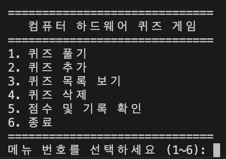
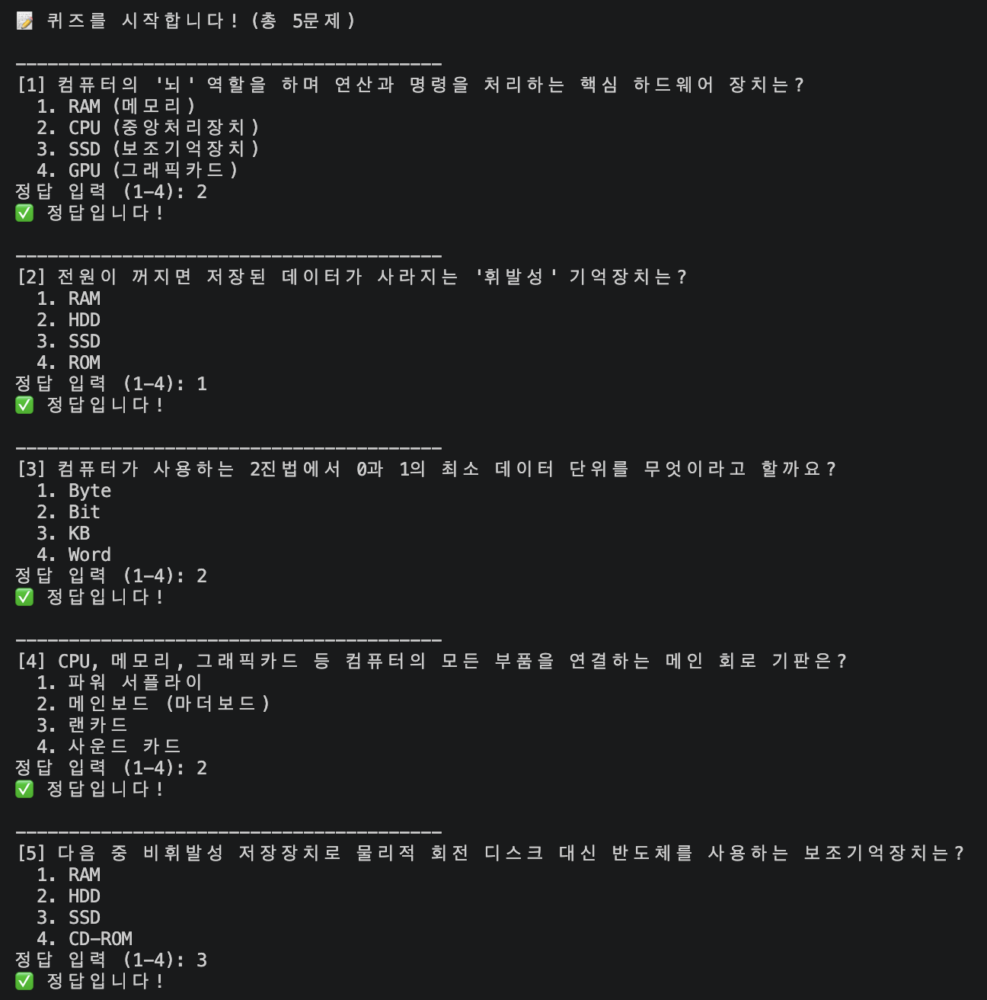
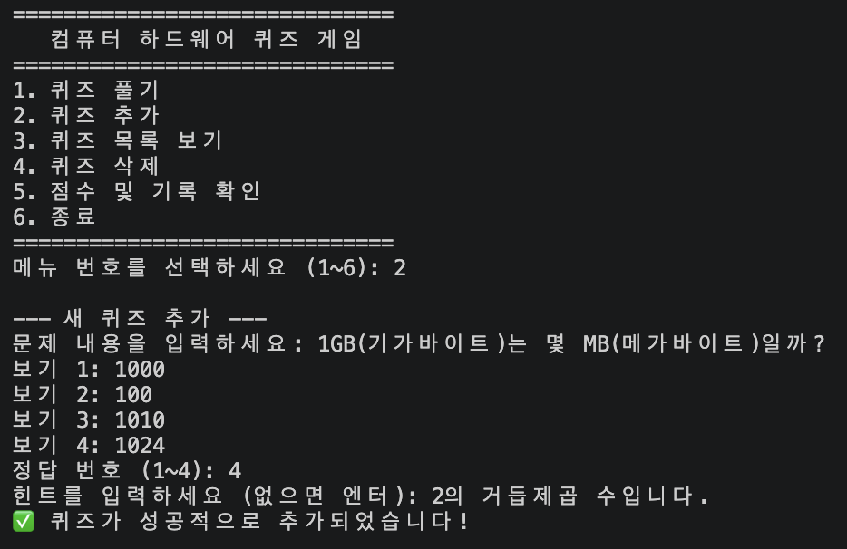
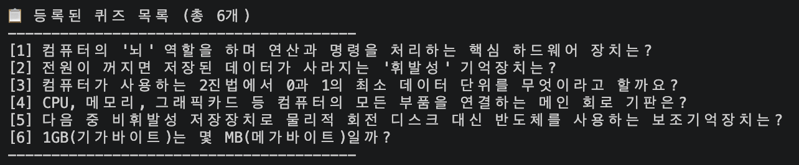
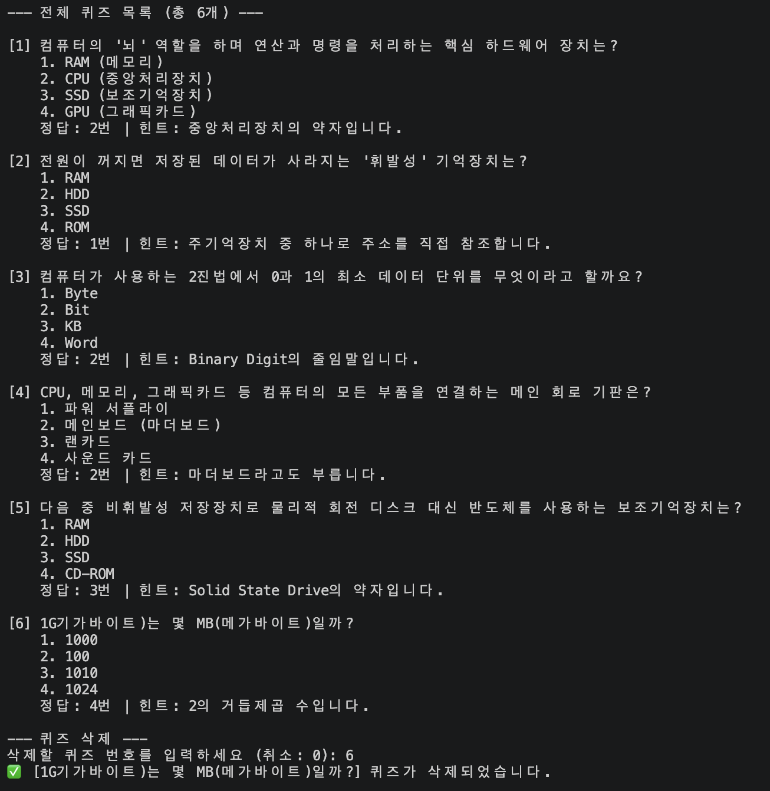
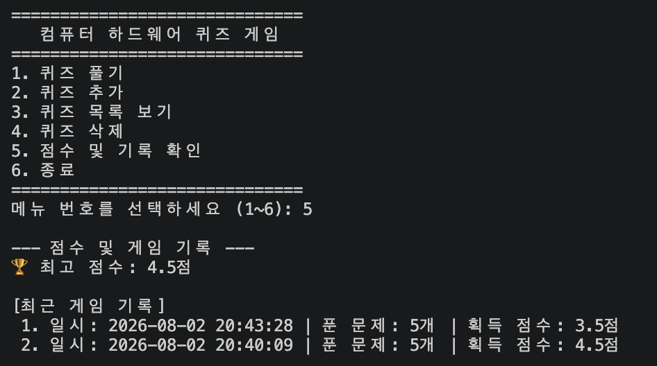

# 콘솔 기반 나만의 퀴즈 게임 (E1-2 Mission)

Python 기본 문법, 객체지향 프로그래밍(OOP), JSON 파일 입출력을 통한 데이터 영속성 처리, 그리고 체계적인 Git 워크플로우를 학습하고 적용한 터미널 퀴즈 게임 프로젝트입니다.

---

## 1. 프로젝트 개요 및 주제 선정 이유

- **프로젝트 명**: 나만의 파이썬/프로그래밍 기초 퀴즈 게임
- **퀴즈 주제**: Python 핵심 문법 및 Git/프로그래밍 기초 지식
- **선정 이유**:
  - 개발 환경을 구축하고 파이썬 기본기를 정립하는 단계에서 필수적인 개념들을 문제 형태로 검증하고자 하였습니다.
  - 객체지향 설계(Quiz, QuizGame) 및 데이터 파일 연동(`state.json`)의 실제 동작 방식을 명확히 확인하기 위해 구현되었습니다.

---

## 2. 실행 방법

1. **프로젝트 디렉토리 이동**:
   ```bash
   cd WOOCHUL_CODYSSEY/E1-2
   ```

2. **프로그램 실행**:
   ```bash
   python3 main.py
   ```

---

## 3. 주요 기능 목록

1. **퀴즈 풀기 (1번)**
    - 등록된 문제들이 순차적으로 출제되며, 1~4번 중 정답을 선택합니다.
    - 풀이가 끝나면 정답 개수 및 최고 점수 갱신 여부를 안내합니다.

2. **퀴즈 추가 (2번)**
    - 문제 질문, 4개의 객관식 선택지, 정답 번호를 직접 등록할 수 있습니다.
    - 입력값 검증을 거쳐 state.json 파일에 즉시 반영됩니다.

3. **퀴즈 목록 (3번)**
    - 현재 저장되어 있는 모든 퀴즈의 질문 목록을 확인할 수 있습니다.

4. **점수 확인 (4번)**
    - 역대 기록 중 맞힌 문제의 최고 점수를 조회합니다.

5. **예외 및 에러 처리 (공통)**
    - 숫자 외 입력(abc), 범위 벗어난 선택, 빈 입력(Enter) 시 안내 메시지 출력 후 재입력 흐름 제공
    - Ctrl+C (KeyboardInterrupt) 및 파일 손상 발생 시 안전 종료 및 기본 데이터 복구 기능 동작

---

## 4. 프로젝트 파일 구조

```text
E1-2/
├── images/             # 실행 결과 스크린샷 폴더
│   ├── add_quiz.png
│   ├── del_quiz.png
│   ├── list_quiz.png
│   ├── menu_quiz.png
│   ├── score_quiz.png
│   └── solve_quiz.png
├── .gitignore          # Git 추적 제외 설정
├── README.md           # 프로젝트 문서화 파일
├── state.json          # 퀴즈 및 점수 데이터 저장소 (자동 생성)
└── main.py             # 게임 실행 메인 코드
```

---

## 5. 데이터 파일 설명 (state.json)

- **경로**:
    - E1-2/state.json

- **역할**:
    - 프로그램을 종료해도 퀴즈 데이터 및 최고 점수가 유지되도록 UTF-8 인코딩으로 저장되는 데이터 파일입니다.

- **필드 구조 (Schema)**:
    - quizzes (Array): 퀴즈 정보 객체들의 리스트
        - question (String): 질문 내용
        - choices (Array of Strings): 4개의 객관식 선택지
        - answer (Integer): 정답 번호 (1~4)
    - best_score (Integer): 현재까지 기록된 최고 정답 문제 수

스키마 예시:
```bash
{
    "quizzes": [
        {
            "question": "컴퓨터의 '뇌' 역할을 하며 연산과 명령을 처리하는 핵심 하드웨어 장치는?",
            "choices": [
                "RAM (메모리)",
                "CPU (중앙처리장치)",
                "SSD (보조기억장치)",
                "GPU (그래픽카드)"
            ],
            "answer": 2,
            "hint": "중앙처리장치의 약자입니다."
        },
        {
            "question": "전원이 꺼지면 저장된 데이터가 사라지는 '휘발성' 기억장치는?",
            "choices": [
                "RAM",
                "HDD",
                "SSD",
                "ROM"
            ],
            "answer": 1,
            "hint": "주기억장치 중 하나로 주소를 직접 참조합니다."
        },
        {
            "question": "컴퓨터가 사용하는 2진법에서 0과 1의 최소 데이터 단위를 무엇이라고 할까요?",
            "choices": [
                "Byte",
                "Bit",
                "KB",
                "Word"
            ],
            "answer": 2,
            "hint": "Binary Digit의 줄임말입니다."
        },
        {
            "question": "CPU, 메모리, 그래픽카드 등 컴퓨터의 모든 부품을 연결하는 메인 회로 기판은?",
            "choices": [
                "파워 서플라이",
                "메인보드 (마더보드)",
                "랜카드",
                "사운드 카드"
            ],
            "answer": 2,
            "hint": "마더보드라고도 부릅니다."
        },
        {
            "question": "다음 중 비휘발성 저장장치로 물리적 회전 디스크 대신 반도체를 사용하는 보조기억장치는?",
            "choices": [
                "RAM",
                "HDD",
                "SSD",
                "CD-ROM"
            ],
            "answer": 3,
            "hint": "Solid State Drive의 약자입니다."
        }
    ],
    "best_score": 4.5,
    "history": [
        {
            "date": "2026-08-02 20:40:09",
            "total_questions": 5,
            "score": 4.5
        },
        {
            "date": "2026-08-02 20:43:28",
            "total_questions": 5,
            "score": 3.5
        },
        {
            "date": "2026-08-02 22:07:19",
            "total_questions": 1,
            "score": 1.0
        }
    ]
}
```

---

## 6. 실행 화면 스크린샷

| 기능 | 실행 화면 |
| :--- | :--- |
| 메인 메뉴 |  |
| 퀴즈 풀기 |  |
| 퀴즈 추가 |  |
| 퀴즈 목록 |  |
| 퀴즈 삭제 |  |
| 점수 확인 |  |

---

## 7. 보너스 구현 기능 (Bonus Features)

기본 요구사항 외에 사용자 경험과 게임성을 높이기 위해 아래 5가지 보너스 기능을 추가로 구현하였습니다.

- **1) 문제 무작위(Random) 출제**
  - `random.sample()` 모듈을 활용하여 퀴즈 풀기 진행 시 문제 순서가 매번 랜덤하게 섞여 출제되도록 구현했습니다.

- **2) 풀고 싶은 문제 수 선택**
  - 게임 시작 전 전체 보유 퀴즈 수(기본 5개 이상) 내에서 사용자가 직접 이번 회차에 풀 문제 수(예: 3문제)를 지정할 수 있습니다.

- **3) 힌트(Hint) 시스템 및 점수 차감 로직**
  - `Quiz` 클래스 및 JSON 스키마에 `hint` 속성을 추가했습니다.
  - 문제 풀이 중 `H` 키를 입력하여 힌트를 조회할 수 있으며, 힌트를 사용해 정답을 맞힐 경우 정답 점수가 차감(1.0점 ➔ 0.5점) 적용됩니다.

- **4) 퀴즈 삭제 기능 (데이터 동기화)**
  - 메뉴에서 등록된 퀴즈 목록을 확인하고 불필요한 퀴즈를 번호 선택으로 삭제할 수 있습니다.
  - 삭제 내역은 프로젝트 루트의 `state.json`에 즉시 반영되어 보존됩니다.

- **5) 게임 히스토리(History) 누적 기록**
  - 최고 점수(`best_score`)뿐만 아니라 게임을 플레이한 날짜/시간(`date`), 푼 문제 수(`total_questions`), 획득 점수(`score`)를 `state.json`에 배열 형태로 계속 누적 저장합니다.
  - 메뉴를 통해 최근 게임 기록 내역을 직관적으로 확인할 수 있습니다.