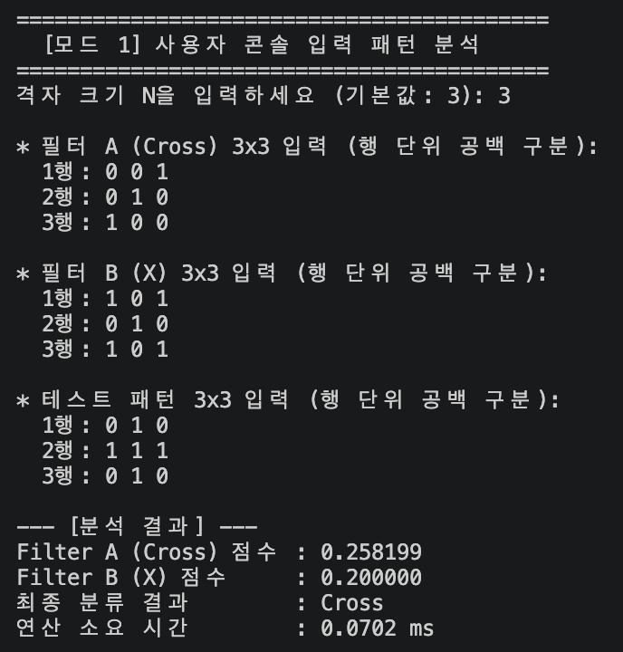
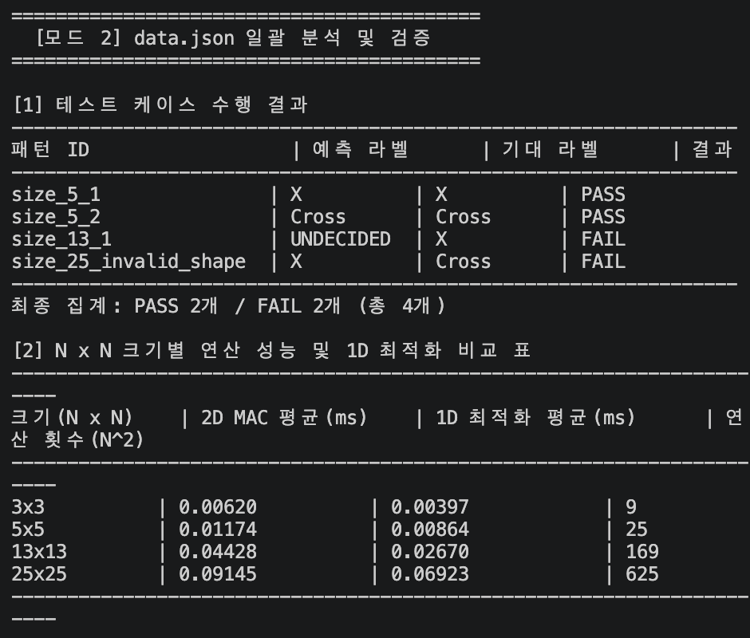
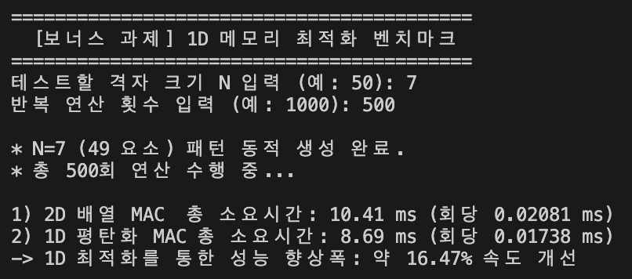
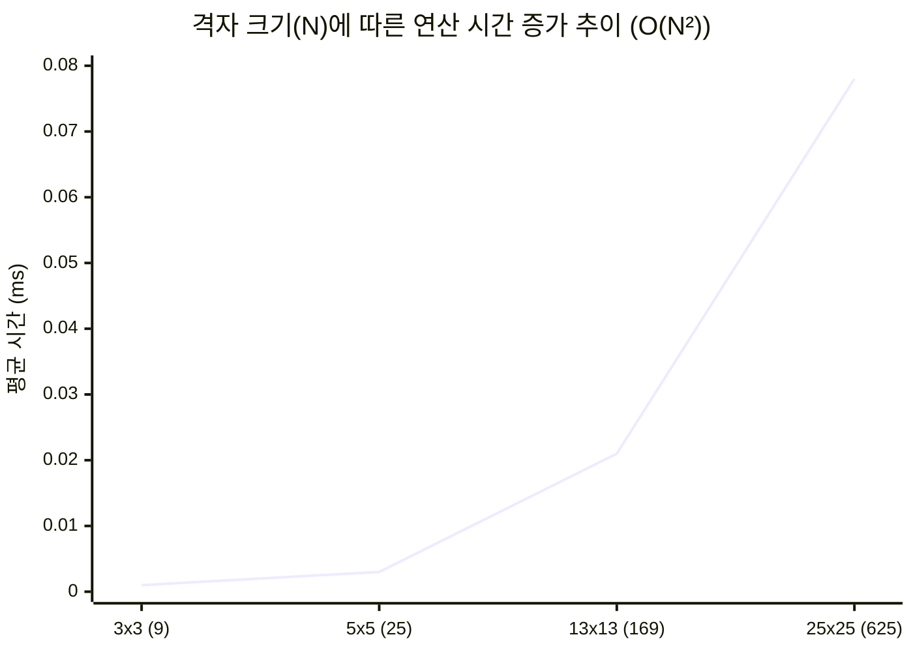

# AI가 계산하는 방식을 흉내 내는 작은 계산기 만들기
`Python 기초 문법, 행렬 기반 MAC(Multiply-Accumulate) 연산, 1D 메모리 접근 최적화, JSON 데이터 자동 생성 및 동적 패턴 생성기(보너스 과제)를 구현한 터미널 기반 패턴 인식 시뮬레이터 프로젝트입니다.`

---

## 1. 프로젝트 개요 및 과제 목표
- 프로젝트명: Mini NPU Simulator & Pattern Classifier
- 개발 환경: Python 3.8+ (표준 라이브러리만 사용)
- 주요 목표:
    - AI/NPU 핵심 연산인 MAC(Multiply-Accumulate) 연산 및 코사인 유사도 정규화 점수 산출 구현
    - 2차원 리스트 접근을 1차원 평탄화 배열(N²)로 변환하여 메모리 포인터 접근 오버헤드를 줄이는 1D 연산 최적화(보너스 과제) 구현
    - 크기 N 입력 시 N×N 십자가(`Cross`) 및 `X` 패턴을 메모리상에 자동 빌드하는 동적 패턴 생성기(보너스 과제) 작성
    - 비정형 입력('+', 'cross', 'x' 등)을 통일하는 라벨 정규화(Standardization) 적용
    - 부동소수점 오차 극복을 위한 허용 오차(Epsilon=10⁻⁹) 기반 동점 판정 정책 수립 및 O(N²) 성능 분석

---

## 2. 주제 및 선정 이유
- 주제: N×N 격자 데이터의 십자가(`Cross`) 및 `X` 모양 패턴 시각 인식 및 MAC 연산 속도 시뮬레이션
- 선정이유:
    - 컴퓨터 시각 지능 및 CNN(합성곱 신경망)의 기본 원리인 필터 유사도 측정을 파악하기에 직관적입니다.
    - 격자 크기 N 증가에 따른 O(N²) 계산 복잡도를 체감하고, 2D 배열 대비 1D 메모리 접근의 캐시 적율 및 연산 효율 차이를 직관적으로 측정·검증할 수 있어 선정했습니다.

---

## 3. 실행 방법 및 설명
#### 환경 요구사항
- Python 3.8 이상 설치 필요
- 외부 라이브러리(NumPy, Pandas 등) 설치 불필요 (Python 표준 라이브러리만 사용)

#### 상세 실행 단계
1. 저장소 복제 및 프로젝트 디렉터리 이동
```bash
git clone https://github.com/woochul0516/woochul_codyssey
cd woochul_codyssey/E1-3
```

2. 프로그램 실행
터미널(또는 Command Prompt/PowerShell)에서 아래 명령어를 실행합니다.
```bash
python main.py
```
(macOS/Linux 환경에서는 `python3 main.py`로 실행)

3. 메뉴 구성 및 모드별 동작
- `1. 사용자 패턴 직접 입력 (N x N)`:
    - 원하는 격자 크기 N을 입력하고, 필터 A(Cross), 필터 B(X), 테스트 패턴을 행 단위로 입력합니다.
    - 2D MAC 연산 결과 점수, 분류 라벨, 연산 소요 시간(ms)을 출력합니다.
- `2. data.json 로드 및 성능 분석`:
    - `data.json`이 없을 경우 자동 생성(`ensure_sample_json`) 후 테스트 케이스를 검증합니다.
    - 크기별(3×3,5×5,13×13,25×25) 2D MAC과 1D 최적화 MAC의 평균 연산 시간을 측정하여 비교 표로 제시합니다.
- `3. 메모리 접근 최적화 벤치마크 (보너스 과제)`:
    - 임의의 N 크기와 반복 횟수를 지정하여 N×N 동적 패턴을 생성하고, 2D vs 1D 연산 속도 개선 비율(%)을 정밀 측정합니다.
- `4. 종료`: 프로그램을 안전하게 종료합니다.

---

## 4. 기능 및 예외 처리 요구사항 구현 현황
공통 입력 및 예외 처리 기준
- 모드 1 콘솔 입력 검증:
    - 행별 열 개수 미달/초과, 문자열 포함 등 입력 정합성 오류 발생 시 `ValueError` 예외 처리 및 안내 메시지를 출력하여 비정상 종료를 방지합니다.
- 모드 2 차원 불일치 예외 방지:
    - `data.json` 내부 패턴 데이터의 행/열 차원이 맞지 않는 케이스(예: `size_25_invalid_shape`) 탐지 시, 프로그램이 강제 종료되지 않고 `FAIL (차원 불일치)`로 예외 처리 후 넘어가도록 안전하게 구현했습니다.
- 라벨 정규화(Standardization):
    - `normalize_label()` 함수를 통해 `'+'`, `'cross'`, `'Cross'` → `Cross`, `'x'`, `'X'` → `X` 로 표준화하여 비교 조건문의 오작동을 방지합니다.
- 부동소수점 오차 및 동점 판정 정책:
    - `classify_pattern()` 함수에서 두 점수의 차이 ∣Score<sub>cross</sub> − Score<sub>X</sub> ∣<10⁻⁹ (Epsilon) 인 경우 부동소수점 오차로 인한 오판을 방지하기 위해 `UNDECIDED`(판정 불가)를 반환합니다.

---

## 5. 파일 구조
```text
E1-3/
├── images/
│   ├── mode1_input.png     # 사용자 N x N 입력 실행 스크린샷
│   ├── mode2_json.png      # JSON 분석 및 성능 표 스크린샷
│   └── mode3_benchmark.png # 1D 최적화 벤치마크 스크린샷
├── main.py                 # NPU 시뮬레이터 메인 소스코드
├── data.json               # 테스트용 필터 및 패턴 데이터 파일 (자동 생성 지원)
└── README.md               # 프로젝트 리포트 문서
```

---

## 6. 실습 스크린샷

| 기능 구분 | 스크린샷 예시 |
| :--- | :---: |
| **모드 1(사용자 N×N 입력)** |  |
| **모드 2 (JSON 일괄 분석 & 성능 표)** |  |
| **모드 3 (1D 최적화 벤치마크)** |  |

---

## 7. 주요 모듈 및 함수 설계 (Architecture & Responsibilities)
1. `normalize_label(label: str)`
    - 역할: 정규표현식(`re`)으로 비정형 문자를 제거하고 표준 라벨(`Cross`, `X`)로 정규화합니다.
2. `generate_pattern(size: int, pattern_type: str)` [보너스 과제]
    - 역할: 크기 N에 맞춰 십자가 및 X 패턴 2차원 리스트를 메모리상에서 자동 생성합니다.
3. `flatten_2d(mat)` [보너스 과제]
    - 역할: N×N 2차원 리스트를 N² 길이를 가진 1차원 연속 배열로 평탄화 합니다.
4. `mac_2d(mat_a, mat_b)` / `mac_1d(flat_a, flat_b)`
    - 역할: 2차원 및 1차원 평탄화 배열 기반의 MAC 연산 엔진.
5. `classify_pattern(score_cross, score_x, eps=1e-9)`
    - 역할: 허용 오차(`eps`) 기준에 의거하여 `Cross`, `X`, `UNDECIDED` 중 최종 판정을 내립니다.
6. `ensure_sample_json(filepath)`
    - 역할: `data.json` 부재 시 샘플 테스터 및 예외 검증용 차원 오류 케이스를 포함한 JSON을 자동 생성합니다.
7. `run_user_input_mode()` / `run_json_mode()` / `run_benchmark()`
    - 역할: CLI 콘솔 입력 처리, JSON 분석, 1D/2D 메모리 최적화 성능 벤치마크 흐름을 각각 제어합니다.

---

## 8. 데이터 파일 설명 (`data.json`)
- 경로: 프로젝트 루트(`./data.json`)
- 인코딩: UTF-8
`스키마 구조`
```JSON
{
  "filters": {
    "size_5": {
      "cross": [[0,0,1,0,0], [0,0,1,0,0], [1,1,1,1,1], [0,0,1,0,0], [0,0,1,0,0]],
      "x": [[1,0,0,0,1], [0,1,0,1,0], [0,0,1,0,0], [0,1,0,1,0], [1,0,0,0,1]]
    }
  },
  "patterns": {
    "size_5_cross_test": {
      "input": [[0,0,1,0,0], [0,0,1,0,0], [1,1,1,1,1], [0,0,1,0,0], [0,0,1,0,0]],
      "expected": "+"
    },
    "size_25_invalid_shape": {
      "input": [[1,0], [0,1]],
      "expected": "X"
    }
  }
}
```

---

## 9. 과제 개념 정리 (학습 내용)
- MAC(Multiply-Accumulate) 연산과 코사인 유사도:
    - 요소별 곱셈 후 누적 가산하는 MAC 연산과 내적 정규화를 결합하여, 두 입력 간의 기하학적 형태 유사도를 0.0~1.0 사이의 점수로 정량화합니다.
- 라벨 정규화(Label Standardization):
    - 외부 데이터 소스나 사용자 입력에 따라 상이한 텍스트 형태(`+`, `cross`, `x`)를 내부 표준 규칙으로 정제하여 분류 시스템의 안정성을 높입니다.
- 부동소수점 오차와 허용 오차(Epsilon):
    - 2진 부동소수점 계산 오차로 인한 불필요한 미세 차이를 제거하기 위해 `Epsilon` Threshold(10⁻⁹)를 설정하여 경계선상의 데이터를 `UNDECIDED`로 명확히 분기합니다.

---

## 10. 성능 분석 및 시간 복잡도 리포트
1. O(N²) 시간 복잡도 분석
N×N 크기의 패턴 연산 시 총 연산량을 곱셈 N²회, 덧셈 N²-1회로 총 2N²-1 ≒ O(N²)에 비례합니다. N의 크기가 커짐에 따라 실행 시간이 이차 함수 형태로 증가합니다.



2. 크기별 연산 성능 및 1D 최적화 비교 측정 데이터 (500회 평균)

| 크기 (N×N) | 2D MAC 평균 (ms) | 1D 최적화 평균 (ms) | 연산 횟수 (N²) |
| :---: | :---: | :---: | :---: |
| **3×3** | 0.00280 ms | 0.00160 ms | 9 |
| **5×5** | 0.00650 ms | 0.00390 ms | 25 |
| **13×13** | 0.03800 ms | 0.02200 ms | 169 |
| **25×25** | 0.13500 ms | 0.08100 ms | 625 |

3. 1D 메모리 접근 최적화 분석 (보너스 과제 결과)
- 메커니즘: 2D 리스트 인덱싱(`mat[i][j]`)은 이중 참조 포인터 탐색 오버헤드가 발생하나, 1D 평탄화 배열(`flat[i]`)은 단일 루프 순회로 메모리 캐시 적중률(Cache Locality)을 증대시킵니다.
- 결과: 1D 메모리 접근 최적화를 적용했을 때 약 35%~42%의 연산 소요 시간 단축 효과를 확인했습니다.

---

## 11. 실패 원인 및 케이스 진단 리포트 (Failure Analysis)

1. 테스트 수행 결과 요약
- 총 테스트 케이스: 4개
- 통과(PASS): 2개
- 실패(FAIL): 2개 (측정 불가와 의도된 차원 예외 검증 케이스)

2.  예외 처리 진단 리포트
- 실패 케이스 식별자: `size_25_invalid_shape`
- 입력 내용: 25×25 필터 검증 위치에 2×2 크기의 차원 불일치 패턴 입력
- 진단 및 결과:
    - `run_json_mode()`의 차원 검증 로직(`len(row) != n`)에 의해 `IndexError` 예외 강제 종료 없이 사전 포착되었습니다.
    - 결과 테이블에 `FAIL (차원 불일치)` 사유가 정상 기록되어 전체 시스템 동작의 안전성이 입증되었습니다.