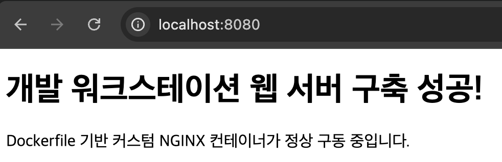

# woochul_codyssey
코디세이 연동용

# 개발 워크스테이션 구축 미션

## 1. 프로젝트 개요
터미널 CLI, OrbStack(Docker), Git/GitHub 환경을 세팅하고 검증하는 워크스테이션 구축 미션입니다.

## 2. 실행 환경
- **OS**: macOS
- **Shell**: zsh
- **Docker**: Docker version 28.5.2, build ecc6942
- **Git**: git version 2.55.0

## 3. 수행 체크리스트
- [x] 터미널 기본 조작 및 권한 변경 실습
- [ ] Docker 기본 명령어 및 컨테이너 실습
- [ ] 웹 서버 Dockerfile 커스텀 이미지 빌드
- [ ] 포트 매핑 접속 검증
- [ ] 바인드 마운트 및 볼륨 영속성 검증
- [ ] Git 설정 및 GitHub 연동

---

## 4. 터미널 조작 및 권한 실습 로그

### 4.1. 기본 CLI 명령 실행
dncjf552523857@c1r4s3 woochul_codyssey % pwd
/Users/dncjf552523857/Documents/woochul_codyssey
dncjf552523857@c1r4s3 woochul_codyssey % ls -la
total 8
drwxr-xr-x   4 dncjf552523857  dncjf552523857  128  7 28 20:56 .
drwx------+  4 dncjf552523857  dncjf552523857  128  7 28 20:56 ..
drwxr-xr-x  12 dncjf552523857  dncjf552523857  384  7 28 20:56 .git
-rw-r--r--   1 dncjf552523857  dncjf552523857   42  7 28 20:56 README.md
dncjf552523857@c1r4s3 woochul_codyssey % mkdir practice
dncjf552523857@c1r4s3 woochul_codyssey % cd practice
dncjf552523857@c1r4s3 practice % touch test.txt
dncjf552523857@c1r4s3 practice % ls
test.txt
dncjf552523857@c1r4s3 practice % touch test.txt
dncjf552523857@c1r4s3 practice % ls
test.txt
dncjf552523857@c1r4s3 practice % echo "Hello Workstation" > test.txt
dncjf552523857@c1r4s3 practice % cat test.txt
Hello Workstation
dncjf552523857@c1r4s3 practice % cp test.txt test_copy.txt
dncjf552523857@c1r4s3 practice % mv test_copy.txt renamed_test.txt
dncjf552523857@c1r4s3 practice % ls
renamed_test.txt	test.txt
dncjf552523857@c1r4s3 practice % rm renamed_test.txt
dncjf552523857@c1r4s3 practice % ls
test.txt

### 4.2. 권한 변경 실습 (파일 & 디렉토리)
dncjf552523857@c1r4s3 practice % ls -l test.txt
-rw-r--r--  1 dncjf552523857  dncjf552523857  18  7 28 21:03 test.txt
dncjf552523857@c1r4s3 practice % chmod 644 test.txt
dncjf552523857@c1r4s3 practice % ls -l test.txt
-rw-r--r--  1 dncjf552523857  dncjf552523857  18  7 28 21:03 test.txt
dncjf552523857@c1r4s3 practice % mkdir test_dir
dncjf552523857@c1r4s3 practice % ls -ld test_dir
drwxr-xr-x  2 dncjf552523857  dncjf552523857  64  7 28 21:07 test_dir
dncjf552523857@c1r4s3 practice % chmod 755 test_dir
dncjf552523857@c1r4s3 practice % ls -ld test_dir
drwxr-xr-x  2 dncjf552523857  dncjf552523857  64  7 28 21:07 test_dir

## 4.3. Docker 설치 및 기본 점검

### 1) Docker 버전 확인
dncjf552523857@c1r4s3 practice % docker --version
Docker version 28.5.2, build ecc6942

### 2) Docker 데몬 상태 확인
dncjf552523857@c1r4s3 practice % docker info
Client:
 Version:    28.5.2
 Context:    orbstack
 Debug Mode: false
 Plugins:
  buildx: Docker Buildx (Docker Inc.)
    Version:  v0.29.1
    Path:     /Users/dncjf552523857/.docker/cli-plugins/docker-buildx
  compose: Docker Compose (Docker Inc.)
    Version:  v2.40.3
    Path:     /Users/dncjf552523857/.docker/cli-plugins/docker-compose

Server:
 Containers: 0
  Running: 0
  Paused: 0
  Stopped: 0
 Images: 0
 Server Version: 28.5.2
 Storage Driver: overlay2
  Backing Filesystem: btrfs
  Supports d_type: true
  Using metacopy: false
  Native Overlay Diff: true
  userxattr: false
 Logging Driver: json-file
 Cgroup Driver: cgroupfs
 Cgroup Version: 2
 Plugins:
  Volume: local
  Network: bridge host ipvlan macvlan null overlay
  Log: awslogs fluentd gcplogs gelf journald json-file local splunk syslog
 CDI spec directories:
  /etc/cdi
  /var/run/cdi
 Swarm: inactive
 Runtimes: io.containerd.runc.v2 runc
 Default Runtime: runc
 Init Binary: docker-init
 containerd version: 1c4457e00facac03ce1d75f7b6777a7a851e5c41
 runc version: d842d7719497cc3b774fd71620278ac9e17710e0
 init version: de40ad0
 Security Options:
  seccomp
   Profile: builtin
  cgroupns
 Kernel Version: 6.17.8-orbstack-00308-g8f9c941121b1
 Operating System: OrbStack
 OSType: linux
 Architecture: x86_64
 CPUs: 6
 Total Memory: 15.67GiB
 Name: orbstack
 ID: 0adaeff4-7b45-428d-844e-a18da27b5035
 Docker Root Dir: /var/lib/docker
 Debug Mode: false
 Experimental: false
 Insecure Registries:
  ::1/128
  127.0.0.0/8
 Live Restore Enabled: false
 Product License: Community Engine
 Default Address Pools:
   Base: 192.168.97.0/24, Size: 24
   Base: 192.168.107.0/24, Size: 24
   Base: 192.168.117.0/24, Size: 24
   Base: 192.168.147.0/24, Size: 24
   Base: 192.168.148.0/24, Size: 24
   Base: 192.168.155.0/24, Size: 24
   Base: 192.168.156.0/24, Size: 24
   Base: 192.168.158.0/24, Size: 24
   Base: 192.168.163.0/24, Size: 24
   Base: 192.168.164.0/24, Size: 24
   Base: 192.168.165.0/24, Size: 24
   Base: 192.168.166.0/24, Size: 24
   Base: 192.168.167.0/24, Size: 24
   Base: 192.168.171.0/24, Size: 24
   Base: 192.168.172.0/24, Size: 24
   Base: 192.168.181.0/24, Size: 24
   Base: 192.168.183.0/24, Size: 24
   Base: 192.168.186.0/24, Size: 24
   Base: 192.168.207.0/24, Size: 24
   Base: 192.168.214.0/24, Size: 24
   Base: 192.168.215.0/24, Size: 24
   Base: 192.168.216.0/24, Size: 24
   Base: 192.168.223.0/24, Size: 24
   Base: 192.168.227.0/24, Size: 24
   Base: 192.168.228.0/24, Size: 24
   Base: 192.168.229.0/24, Size: 24
   Base: 192.168.237.0/24, Size: 24
   Base: 192.168.239.0/24, Size: 24
   Base: 192.168.242.0/24, Size: 24
   Base: 192.168.247.0/24, Size: 24
   Base: fd07:b51a:cc66:d000::/56, Size: 64

WARNING: DOCKER_INSECURE_NO_IPTABLES_RAW is set

## 4.4) Docker 기본 운영 및 컨테이너 실습
### 1) hello-world 실행
dncjf552523857@c1r4s3 practice % docker run hello-world
Unable to find image 'hello-world:latest' locally
latest: Pulling from library/hello-world
4f55086f7dd0: Pull complete 
Digest: sha256:c3cbe1cc1aa588a64951ac6286e0df7b27fe2e6324b1001c619bb358770c0178
Status: Downloaded newer image for hello-world:latest

Hello from Docker!
This message shows that your installation appears to be working correctly.

To generate this message, Docker took the following steps:
 1. The Docker client contacted the Docker daemon.
 2. The Docker daemon pulled the "hello-world" image from the Docker Hub.
    (amd64)
 3. The Docker daemon created a new container from that image which runs the
    executable that produces the output you are currently reading.
 4. The Docker daemon streamed that output to the Docker client, which sent it
    to your terminal.

To try something more ambitious, you can run an Ubuntu container with:
 $ docker run -it ubuntu bash

Share images, automate workflows, and more with a free Docker ID:
 https://hub.docker.com/

For more examples and ideas, visit:
 https://docs.docker.com/get-started/

### 2) ubuntu 컨테이너 진입 및 내부 명령어 수행
dncjf552523857@c1r4s3 practice % docker run -it ubuntu bash
Unable to find image 'ubuntu:latest' locally
latest: Pulling from library/ubuntu
ed819469700f: Pull complete 
a3679419df18: Pull complete 
Digest: sha256:3131b4cc82a783df6c9df078f86e01819a13594b865c2cad47bd1bca2b7063bb
Status: Downloaded newer image for ubuntu:latest
root@c99dc715217e:/# ls -la
total 16
drwxr-xr-x   1 root root   6 Jul 28 12:30 .
drwxr-xr-x   1 root root   6 Jul 28 12:30 ..
-rwxr-xr-x   1 root root   0 Jul 28 12:30 .dockerenv
drwxr-xr-x   1 root root  26 Jul 13 16:06 .rock
lrwxrwxrwx   1 root root   7 Apr 20 08:46 bin -> usr/bin
drwxr-xr-x   1 root root   0 Apr 20 08:46 boot
drwxr-xr-x   5 root root 340 Jul 28 12:30 dev
drwxr-xr-x   1 root root  56 Jul 28 12:30 etc
drwxr-xr-x   1 root root  12 Jul 13 16:06 home
lrwxrwxrwx   1 root root   7 Apr 20 08:46 lib -> usr/lib
lrwxrwxrwx   1 root root   9 Apr 20 08:46 lib64 -> usr/lib64
drwxr-xr-x   1 root root   0 Jul 13 16:05 media
drwxr-xr-x   1 root root   0 Jul 13 16:05 mnt
drwxr-xr-x   1 root root   0 Jul 13 16:05 opt
dr-xr-xr-x 233 root root   0 Jul 28 12:30 proc
drwx------   1 root root  30 Jul 13 16:06 root
drwxr-xr-x   1 root root  22 Jul 13 16:06 run
lrwxrwxrwx   1 root root   8 Apr 20 08:46 sbin -> usr/sbin
drwxr-xr-x   1 root root   0 Jul 13 16:05 srv
dr-xr-xr-x  11 root root   0 Jul 28 12:30 sys
drwxrwxrwt   1 root root   0 Jul 13 16:06 tmp
drwxr-xr-x   1 root root  10 Jul 13 16:05 usr
drwxr-xr-x   1 root root  90 Jul 13 16:06 var
root@c99dc715217e:/# echo "Hello Docker Container"
Hello Docker Container
root@c99dc715217e:/# exit
exit

### 3) 이미지 및 컨테이너 목록 확인
dncjf552523857@c1r4s3 practice % docker images
REPOSITORY    TAG       IMAGE ID       CREATED        SIZE
ubuntu        latest    de7345b16e94   2 weeks ago    100MB
hello-world   latest    e2ac70e7319a   4 months ago   10.1kB

dncjf552523857@c1r4s3 practice % docker ps -a
CONTAINER ID   IMAGE         COMMAND    CREATED         STATUS                     PORTS     NAMES
c99dc715217e   ubuntu        "bash"     3 minutes ago   Exited (0) 2 minutes ago             peaceful_poitras
99b24f417dc9   hello-world   "/hello"   4 minutes ago   Exited (0) 4 minutes ago             competent_shirley

## 4.5 커스텀 웹 서버 이미지 빌드 및 포트 매핑

### 1. Dockerfile 내용
```dockerfile
FROM nginx:alpine
COPY app/index.html /usr/share/nginx/html/index.html
EXPOSE 80
```

### 2. 터미널 실행 결과
dncjf552523857@c1r4s3 practice % mkdir -p app
dncjf552523857@c1r4s3 practice % cat << 'EOF' > app/index.html
heredoc> <!DOCTYPE html>
<html>
<head>
    <meta charset="UTF-8">
    <title>My Dev Workstation</title>
</head>
<body>
    <h1>개발 워크스테이션 웹 서버 구축 성공!</h1>
    <p>Dockerfile 기반 커스텀 NGINX 컨테이너가 정상 구동 중입니다.</p>
</body>
</html>
EOF
dncjf552523857@c1r4s3 practice % cat << 'EOF' > Dockerfile
heredoc> FROM nginx:alpine
COPY app/index.html /usr/share/nginx/html/index.html
EXPOSE 80
EOF
dncjf552523857@c1r4s3 practice % docker build -t my-web:1.0 .
[+] Building 6.8s (7/7) FINISHED                                                                    docker:orbstack
 => [internal] load build definition from Dockerfile                                                           0.2s
 => => transferring dockerfile: 118B                                                                           0.0s
 => [internal] load metadata for docker.io/library/nginx:alpine                                                2.8s
 => [internal] load .dockerignore                                                                              0.1s
 => => transferring context: 2B                                                                                0.0s
 => [internal] load build context                                                                              0.2s
 => => transferring context: 350B                                                                              0.0s
 => [1/2] FROM docker.io/library/nginx:alpine@sha256:4a73073bd557c65b759505da037898b61f1be6cbcc3c2c3aeac22d2a  2.9s
 => => resolve docker.io/library/nginx:alpine@sha256:4a73073bd557c65b759505da037898b61f1be6cbcc3c2c3aeac22d2a  0.2s
 => => sha256:4a73073bd557c65b759505da037898b61f1be6cbcc3c2c3aeac22d2a470c1752 10.33kB / 10.33kB               0.0s
 => => sha256:55afa1ecc21d2bb5e5045f32dafee56272ffd89860bac26f6c32123439af26a4 3.85MB / 3.85MB                 0.3s
 => => sha256:1d40e3eb3bf4f138de1d67193f2aa5309fcaf343eb5ffadbf5e9439de1eb1ebb 2.50kB / 2.50kB                 0.0s
 => => sha256:f0ba77f796e57c6fa89ae7f4fdad1665d6fcbd8e3f211535120542b337f9959e 12.32kB / 12.32kB               0.0s
 => => sha256:3cd534fe98c64d68a1f4f1c83abb8d5cba7ecfd7be88e592389929d12e6253da 1.89MB / 1.89MB                 0.5s
 => => sha256:1223f016b4e4a2c21f7c49d4837fbfd47a9da6436b511690ca1e582fc2810d59 627B / 627B                     0.7s
 => => extracting sha256:55afa1ecc21d2bb5e5045f32dafee56272ffd89860bac26f6c32123439af26a4                      0.1s
 => => sha256:62bec68d7c31c4c8a19d812d84da5f7748e54690c037979945b6c5b6c924b142 957B / 957B                     0.8s
 => => extracting sha256:3cd534fe98c64d68a1f4f1c83abb8d5cba7ecfd7be88e592389929d12e6253da                      0.1s
 => => sha256:46f977ee452f4399c208714afa034868d6056864f8a0cf3c643ab143dd802c80 404B / 404B                     0.8s
 => => extracting sha256:1223f016b4e4a2c21f7c49d4837fbfd47a9da6436b511690ca1e582fc2810d59                      0.0s
 => => sha256:d0008c891db48b5f526d914bce9e8d889fe1a9d1f08291ae03fe97f871726f38 1.21kB / 1.21kB                 1.0s
 => => sha256:390dc935348d8070e695fbaae2a4bb114fb9e69c59f628e7576036ee9d5244c9 1.40kB / 1.40kB                 1.1s
 => => extracting sha256:62bec68d7c31c4c8a19d812d84da5f7748e54690c037979945b6c5b6c924b142                      0.0s
 => => sha256:46519e7231d2eb5604df229beb44d59719a489eaa7aca52982535a010b07a9ed 20.31MB / 20.31MB               1.3s
 => => extracting sha256:46f977ee452f4399c208714afa034868d6056864f8a0cf3c643ab143dd802c80                      0.0s
 => => extracting sha256:d0008c891db48b5f526d914bce9e8d889fe1a9d1f08291ae03fe97f871726f38                      0.0s
 => => extracting sha256:390dc935348d8070e695fbaae2a4bb114fb9e69c59f628e7576036ee9d5244c9                      0.0s
 => => extracting sha256:46519e7231d2eb5604df229beb44d59719a489eaa7aca52982535a010b07a9ed                      0.4s
 => [2/2] COPY app/index.html /usr/share/nginx/html/index.html                                                 0.2s
 => exporting to image                                                                                         0.2s
 => => exporting layers                                                                                        0.2s
 => => writing image sha256:39406f3291b209456acbb560e175e006dc9d8d1fc32a05de7c59a6ebc6709975                   0.0s
 => => naming to docker.io/library/my-web:1.0                                                                  0.0s
dncjf552523857@c1r4s3 practice % docker run -d -p 8080:80 --name my-web-8080 my-web:1.0
0c9b4665970f25f0cbd367c4abfb72eb0de23ab39936a4fb91e2f90b9ffdae94
dncjf552523857@c1r4s3 practice % curl http://localhost:8080
<!DOCTYPE html>
<html>
<head>
    <meta charset="UTF-8">
    <title>My Dev Workstation</title>
</head>
<body>
    <h1>개발 워크스테이션 웹 서버 구축 성공!</h1>
    <p>Dockerfile 기반 커스텀 NGINX 컨테이너가 정상 구동 중입니다.</p>
</body>
</html>
dncjf552523857@c1r4s3 practice % mkdir -p images

### 3. 브라우저 접속 화면


## 4.6 바인드 마운트 및 볼륨 영속성 검증

### 1. 바인드 마운트 (실시간 변경 반영)
# 바인드 마운트 컨테이너 실행
dncjf552523857@c1r4s3 practice % docker run -d -p 8081:80 -v $(pwd)/app:/usr/share/nginx/html --name bind-test my-web:1.0
222471b1f2c71b5550c6c2daa98ae671007a340ce6d4708e7a9d14cddb52ca15

# app/index.html 수정 후 접속 확인 (curl)
dncjf552523857@c1r4s3 practice % curl http://localhost:8081
<!DOCTYPE html>
<html>
<head>
    <meta charset="UTF-8">
    <title>My Dev Workstation</title>
</head>
<body>
    <h1>개발 워크스테이션 웹 서버 구축 성공!</h1>
    <p>Dockerfile 기반 커스텀 NGINX 컨테이너가 정상 구동 중입니다.</p>
</body>
</html>


### 2. Docker 볼륨 (컨테이너 삭제 후 데이터 유지 검증)
# 1) 볼륨 생성 및 첫 번째 컨테이너에서 데이터 작성
dncjf552523857@c1r4s3 practice % docker volume create mydata
mydata
dncjf552523857@c1r4s3 practice % docker run -d --name vol-test1 -v mydata:/data ubuntu sleep infinity
74fd44c975be0dac4e3f3b1337f49945be9b0d26b0bdcba248f0a69fc7ad5685
dncjf552523857@c1r4s3 practice % docker exec vol-test1 bash -c "echo 'Persisted Data' > /data/test.txt"

dncjf552523857@c1r4s3 practice % 
dncjf552523857@c1r4s3 practice % docker exec vol-test1 cat /data/test.txt
Persisted Data

# 2) 첫 번째 컨테이너 삭제 후 새 컨테이너에서 데이터 유지 확인
dncjf552523857@c1r4s3 practice % docker rm -f vol-test1
vol-test1
dncjf552523857@c1r4s3 practice % docker run -d --name vol-test2 -v mydata:/data ubuntu sleep infinity
26d5f9b3850d2c9519877c5ce062d7872faff22365b7f54ca044c85de9db554f
dncjf552523857@c1r4s3 practice % docker exec vol-test2 cat /data/test.txt
Persisted Data

## 5. Git 및 GitHub 동기화

### 1. 문제 해결 (Troubleshooting)

- **하위 디렉토리 `.git` 충돌 해결**:
  - `practice/` 디렉토리 내부의 독립적인 `.git` 설정으로 인해 `git add .` 실행 시 서브모듈 인덱싱 에러 발생 (`error: 'practice/' does not have a commit checked out`).
  - `rm -rf practice/.git` 및 `git rm --cached practice` 명령을 실행하여 하위 저장소 설정을 제거하고, 최상위 저장소(`woochul_codyssey`) 기준 단일 Git 관리 구조로 통합 완료.

  dncjf552523857@c1r4s3 practice % git status
현재 브랜치 master

아직 커밋이 없습니다

추적하지 않는 파일:
  (커밋할 사항에 포함하려면 "git add <파일>..."을 사용하십시오)
	Dockerfile
	app/
	images/
	test.txt

커밋할 사항을 추가하지 않았지만 추적하지 않는 파일이 있습니다 (추적하려면 "git
add"를 사용하십시오)
dncjf552523857@c1r4s3 practice % cd ~/Documents/woochul_codyssey
dncjf552523857@c1r4s3 woochul_codyssey % git add .
error: 'practice/' does not have a commit checked out
error: unable to index file 'practice/'
fatal: 파일 추가가 실패했습니다
dncjf552523857@c1r4s3 woochul_codyssey % rm -rf practice/.git
dncjf552523857@c1r4s3 woochul_codyssey % git rm --cached practice 2>/dev/null
dncjf552523857@c1r4s3 woochul_codyssey % git add .
dncjf552523857@c1r4s3 woochul_codyssey % git status
현재 브랜치 main
브랜치가 'origin/main'에 맞게 업데이트된 상태입니다.

커밋할 변경 사항:
  (use "git restore --staged <file>..." to unstage)
	새 파일:       practice/Dockerfile
	새 파일:       practice/app/index.html
	새 파일:       practice/images/port-mapping.png
	새 파일:       practice/test.txt


- **GitHub 인증 실패 해결 (PAT 적용)**:
  - GitHub 비밀번호 인증 중단 정책으로 인한 Push 실패 (`Invalid username or token. Password authentication is not supported`).
  - GitHub Developer Settings에서 Personal Access Token(PAT, `repo` 권한)을 발급받아 인증을 수행하고 원격 저장소(`origin/main`) 동기화 완료.

git commit -m "feat: complete docker workstation setup and volume test"
[main c4fcc1c] feat: complete docker workstation setup and volume test
 Committer: 정우철 <dncjf552523857@c1r4s3.codyssey.kr>
이름과 전자메일 주소를 사용자 이름과 호스트 이름을 이용해서 자동으로
설정했습니다. 이 정보가 맞는지 확인하십시오. 이 메시지를 보지 않으려면 정보를
명시적으로 설정하십시오. 다음 명령어를 실행하고 편집기의 안내에 따라 설정
파일을 편집하십시오:

    git config --global --edit

이렇게 한 다음, 이 커밋에 사용한 신원 정보를 다음과 같이 해서 바꿀 수 있습니다:

    git commit --amend --reset-author

 4 files changed, 15 insertions(+)
 create mode 100644 practice/Dockerfile
 create mode 100644 practice/app/index.html
 create mode 100644 practice/images/port-mapping.png
 create mode 100644 practice/test.txt
dncjf552523857@c1r4s3 woochul_codyssey % git push origin main
Username for 'https://github.com': woochul0516
Password for 'https://woochul0516@github.com': 
remote: Invalid username or token. Password authentication is not supported for Git operations.
fatal: Authentication failed for 'https://github.com/woochul0516/woochul_codyssey/'
dncjf552523857@c1r4s3 woochul_codyssey % git push origin main
Username for 'https://github.com': woochul0516
Password for 'https://woochul0516@github.com': 
오브젝트 나열하는 중: 10, 완료.
오브젝트 개수 세는 중: 100% (10/10), 완료.
Delta compression using up to 6 threads
오브젝트 압축하는 중: 100% (6/6), 완료.
오브젝트 쓰는 중: 100% (9/9), 40.08 KiB | 20.04 MiB/s, 완료.
Total 9 (delta 0), reused 0 (delta 0), pack-reused 0 (from 0)
To https://github.com/woochul0516/woochul_codyssey
   2540f4a..c4fcc1c  main -> main

---

## 6. 최종 제출 명령

# 변경 사항 스테이징 및 커밋
git add .
git commit -m "docs: 개발 워크스테이션 미션 보고서 작성 및 Git 설정 오류 해결"

# 원격 저장소 최종 푸시 (비밀번호 입력 창에 토큰(PAT) 입력)
git push origin main